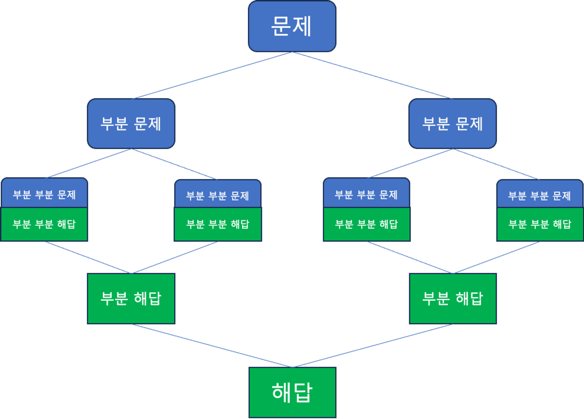
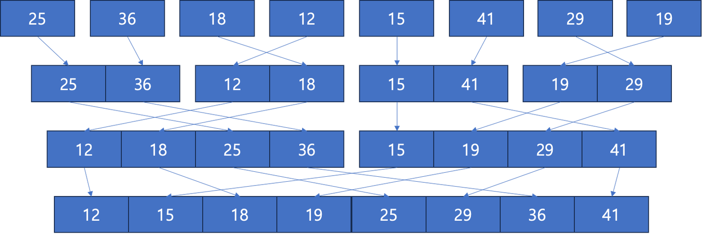
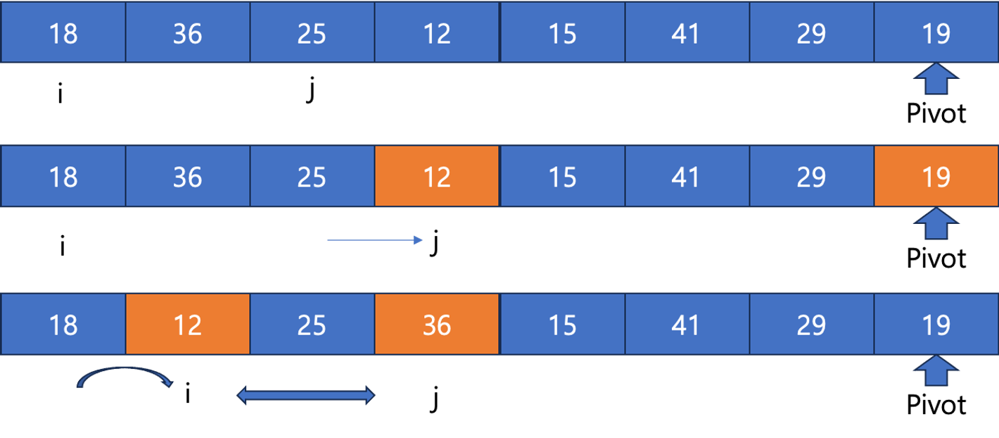
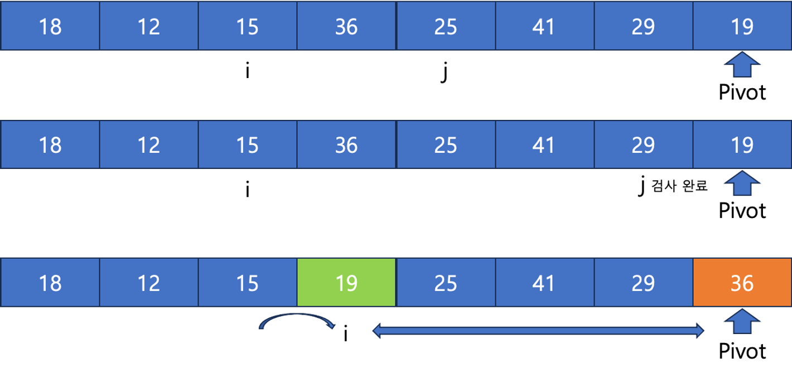

## Divide & Conquer
- 분할 정복 (또는 분할 통치) : 정치학, 군사학 용어
  - 피지배민을 분열시켜 통치에 용이하게 하는 방법
  - 군을 분열시켜 각개격파하는 방법


- 분할 정복 알고리즘 : 큰 문제를 나누어서 풀고, 그 결과를 조합해서 문제를 해결하는 알고리즘 기법
  - 분할(Divide) : 해결할 문제를 여러개의 작은 문제로 나눔
  - 정복(Conquer) : 작은 단위의 문제를 해결
  - 조합(Merge or Combine) : 해결한 작은 단위 문제들을 합해 원래 문제의 답을 구함


- 일반적으로 각 하위 문제들이 독립적으로 풀이가 가능한 형태
- 하위 문제의 결과가 상위 문제의 풀이 방식에 영향을 주지 않을 때, 분할 정복 알고리즘이라고 함
- 특성상 분할정복 알고리즘은 **재귀함수**를 이용해 풀이하는 경우가 많음


### 하노이의 탑 
- 세개의 기둥과 기둥에 꽂을 수 있는 서로 다르 크기의 원반이 있고, 그 원반들이 밑에서부터 큰 것을 차례대로 쌓여있을 때,
- 다른 기둥에 전체 원반들을 옮기는 문제
  - 한번에 하나의 원반만 옮길 수 잇음
  - 가장 위에 쌓은 원반만 옮길 수 있음
  - 큰 원반이 작은 원반 위에 올라갈 수 없음


- 이때 N개의 원반이 기둥(1)에 있다고 가정하면, 
- N개를 한쪽 기둥(3)으로 완전히 옮기는 문제는 N-1개를 일단 다른 기둥(2)에 옮긴 다음
- N번째 제일 큰 원반을 목표 기둥(3)으로 옮긴 뒤 다르 기둥(2)에 있던 N-1개의 원반을 목표 기둥(3)으로 옮기면 됨
```java
import java.io.BufferedReader;
import java.io.IOException;
import java.io.InputStreamReader;

public class Main {
    private StringBuilder towerBuilder;
    public static void main(String[] args) throws IOException {
        new Main().solution();
    }

    public void solution() throws IOException {
        int n = Integer.parseInt(new BufferedReader(new InputStreamReader(System.in)).readLine());
        towerBuilder = new StringBuilder();
        // 점화식을 이용해 풀이
        towerBuilder.append((int) (Math.pow(2, n) - 1)).append('\n');
        hanoi(n, 1, 3, 2);
        System.out.println(towerBuilder);
    }

    public void hanoi(int height, int start, int end, int other) {
        if (height == 1) {
            towerBuilder.append(start + " " + end + "\n");
        }
        else {
            hanoi(height - 1, start, other, end);
            towerBuilder.append(start + " " + end + "\n");
            hanoi(height -1, other, end, start);
        }
    }
}
```

### 병합 정렬(Merge Sort)
- 분할 정복 기법을 이용한 대표적인 정렬 알고리즘
- 정렬되지 않은 배열이 있을때
  - 배열을 두개의 동일한 크기의 배열로 나눔
  - 각 배열에 원소가 하나가 남을 때까지 반복
  - 나눠진 배열을 2개씩 정렬하면서 하나의 배열로 병합



```java
import java.util.Arrays;

public class MergeSort {
    public void sort(int[] arr) {
        // 배열이 비어있거나 길이가 1이라면 정렬할 필요가 없다.
        if (arr == null || arr.length <= 1) {
            return;
        }
        // 정렬 시작
        mergeSort(arr, 0, arr.length - 1);
    }

    private void mergeSort(int[] arr, int left, int right) {
        // left == right 라면 나눠진 배열의 길이는 1
        if (left < right) {
            // 가운데 index 를 찾는다.
            int mid = left + (right - left) / 2;

            // 반으로 나눠서 재귀호출한다.
            mergeSort(arr, left, mid);
            mergeSort(arr, mid + 1, right);

            //
            merge(arr, left, mid, right);
        }
    }

    private void merge(int[] arr, int left, int mid, int right) {
        // 왼쪽 배열과 오른쪽 배열의 크기를 구하고
        int n1 = mid - left + 1;
        int n2 = right - mid;

        // 그 크기만큼 배열을 복사한다.
        int[] leftArr = Arrays.copyOfRange(arr, left, left + n1);
        int[] rightArr = Arrays.copyOfRange(arr, mid + 1, mid + 1 + n2);

        // 임시 배열 둘을 비교하면서 정렬해 원본 배열에 저장한다.
        int i = 0, j = 0, k = left;
        while (i < n1 && j < n2) {
            if (leftArr[i] <= rightArr[j]) {
                arr[k] = leftArr[i];
                i++;
            } else {
                arr[k] = rightArr[j];
                j++;
            }
            k++;
        }

        // 왼쪽 배열에 원소가 남으면 마저 저장하고,
        while (i < n1) {
            arr[k] = leftArr[i];
            i++;
            k++;
        }

        // 오른쪽 배열에 원소가 남으면 마저 저장한다.
        while (j < n2) {
            arr[k] = rightArr[j];
            j++;
            k++;
        }
    }

    public static void main(String[] args) {
        int[] arr = {9, 3, 1, 7, 4, 8, 6, 2, 5};
        new MergeSort().sort(arr);
        System.out.println(Arrays.toString(arr));
    }
}
```

### 퀵 정렬
- 병합 정렬처럼 분할 정복 알고리즘 기법으로 만들어진 정렬 방법
- 어느 정렬되지 않은 배열이 있을 때
  - 배열의 원소 중 하나를 선택해 Pivot으로 설정
  - 배열의 원소들을 각각 Pivot과 비교
    - Pivot보다 작은 원소는 왼쪽
    - Pivot보다 큰 원소는 오른쪽
    - 모든 원소를 다 검사하면 Pivot은 정렬된 위치에 위치하게 됨
  - 이후 Pivot의 왼쪽과 오른쪽 배열을 대상으로 다시 반복




- 퀵 정렬의 경우 최악의 경우 시간 복잡도는 `O(N^2)`
- 선택하는 pivot이 평향되게 항상 크거나 작은 값을 선택하게 되면 분할을 하지 못하기 때문에 
- 사실상 한번의 정렬 과정에 하나의 원소만 정렬되기 때문
- 하지만, 일반적인 경우에는 `O(N^2)`보다 바르게 정렬을 하는 정렬 알고리즘
```java
import java.util.Arrays;

public class QuickSort {
    public void sort(int[] arr) {
        // 비었거나 길이가 1 이하라면 정렬할 필요가 없다.
        if (arr == null || arr.length <= 1) {
            return;
        }

        quickSort(arr, 0, arr.length - 1);
    }

    private void quickSort(int[] arr, int low, int high) {
        if (low < high) {
            // 현재 배열을 나눈다.
            int pivotIndex = partition(arr, low, high);

            // 나눈 배열을 각각 Quick Sort한다.
            quickSort(arr, low, pivotIndex - 1);
            quickSort(arr, pivotIndex + 1, high);
        }
    }

    private int partition(int[] arr, int low, int high) {
        // 오른쪽 끝에 있는 원소를 pivot으로 설정한다.
        int pivot = arr[high];
        // 작은 원소를 보낼 왼쪽 index
        int i = low - 1;

        // 나눠진 배열의 원소를 오른쪽 끝(pivot) 제외 전부 확인한다.
        for (int j = low; j < high; j++) {
            // 현재 원소의 값이 pivot보다 작을 경우
            if (arr[j] <= pivot) {
                i++;
                // 현재 원소를 왼쪽으로 보낸다.
                int temp = arr[i];
                arr[i] = arr[j];
                arr[j] = temp;
            }
        }

        // 이 과정이 끝나면 마지막으로 pivot 보다 작은 원소가 i에 저장된다.
        // i + 1 의 원소와 pivot 의 원소를 교환하면
        // i + 1 의 왼쪽에는 pivot 보다 작은 원소만,
        // i + 1 의 오른쪽에는 pivot 보다 큰 원소만 남는다.
        int temp = arr[i + 1];
        arr[i + 1] = arr[high];
        arr[high] = temp;

        // Quick Sort의 한단계가 끝나면 pivot의 위치에서
        // 좌우 배열을 다시 정렬해야 한다. 이를 위해 pivot의 마지막 위치를 반환한다.
        return i + 1;
    }

    public static void main(String[] args) {
        int[] arr = {9, 3, 1, 7, 4, 8, 6, 2, 5};
        new QuickSort().sort(arr);
        System.out.println(Arrays.toString(arr));
    }
}
```