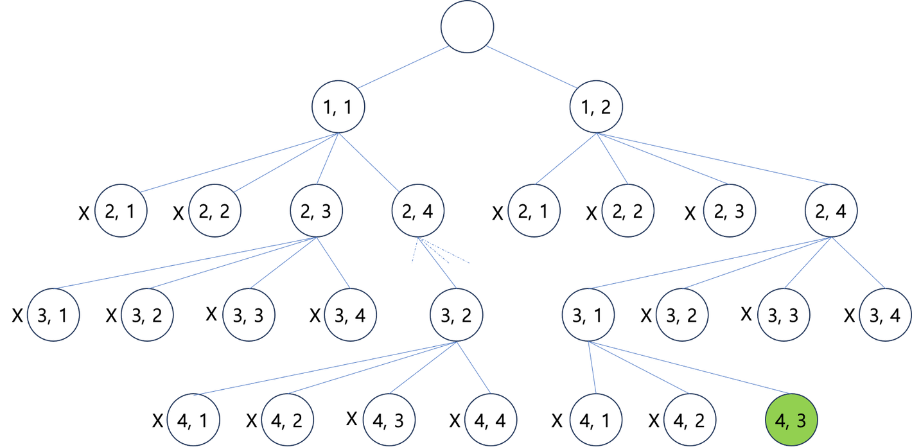

## DP
### Backtracking
- 체스는 정사각형 64개(8 * 8)로 이뤄진 판에 서로 다르 말을 놓아 상대방의 왕을 잡는 게임
- Queen은 가장 가치가 높은 말로, 자신의 위치에서 상하좌우 대각선 방향으로 칸의 제약 없이 이동하고 싶은 만큼 이동 가능


- N-Queen문제는 n * n 사이즈의 체스판이 있을 때, n개의 퀸을 어떻게 배치해야 모든 Queen 들이 서로를 위협하지 않는지를 판단하는 문제
- N = 8일 때
  - N-Queen문제의 해답이 될 수 있는 경우의 수는 총 64개의 칸 중 순서를 구분하지 않고 8개의 칸을 선택하는 경우의 수
  
  - 실제 N-Queen 문제의 해답은 92가지


- N = 4일 때
  - 4-Queen 상황을 상태공간 트리로 표현하면 아래와 같음
  
  - 이때 퀸을 놓을 칸을 정하는 방법은, 한 열에 한칸에 퀸을 배치하고 다음 줄로 이동하는 방식
  - 각 노드의 (x, y)는 x번째 줄에 y번째 칸에 퀸을 배치했다는 의미
  - (1,1), (2,1), (3,1), (4,1) 로 이동한 결과 모든 퀸을 앞쪽 칸에 그렸음을 나타냄
  - 생략된 나머지 노드까지 한 level에 4개의 노드씩 총 256개
  - 첫번째 줄에 첫번재 칸에 퀸을 배치했다면 다음 줄에는 당
  
  - 첫번째 줄에 첫번째 칸에 퀸을 배치했다면, 다음 줄의 첫번째 칸에는 퀸을 배치할 수 없음


- **백트래킹**
  - 이렇게 어느 한 노드에 도달했을 때, 해당 노드가 얼마나 유망한지를 조사하여 다음 자식 노드를 방문할지 말지를 결저하는 알고리즘 기법
  - 상태 공간 트리를 탐색하는 과정에서 아래쪽 가지를 더이상 탐색하지 않는다는 의미로 가지치기(pruning)이라고도 함


- 상태 공간 트리를 깊이 우선 탐색(DFS)
- 노드에 도달했을 때, 해당 노드가 유망한지를 검사
- 유망하지 않으면 최대 깊이까지 진행하지 않고 바로 부모 노드로 복귀하여 다음 노드 검사


## Dynamic Programming
- 피보나치 수열
  - 수열의 k번째 숫자가, k-1번째 숫자와 k-2번째 숫자를 더한 값으로 이루어진 수열
  - 이 수열을 이루는 숫자를 피보나치 수라고 함
  - n번째 피보나치 수는 Fn으로 표현 `Fn = Fn--1 + Fn-2`
  - F(1) = F(2) = 1
```java
public int fiboSimple(int n) {
    if (n < 1)
        return 0;
    if (n == 1 || n == 2)
        return 1;
    return fiboSimple(n - 1) + fiboSimple(n - 2);
}
```

- 구현의 간단함과는 별개로 메서드를 호출하게 될 경우, 지나치게 많은 중복 호출이 발생


### Memoization
- 이전에 계산한 피보나치 수열의 결과를 기억하고 있다면, 해당 결과를 다음 피보나치 수를 구하는데 활용 가능
- 재귀 호출마다 해당 기억 요소를 전달하면, 후순위로 호출된 재귀함수는 이전에 계산한 결과를 활용하여 중복 호출을 막을 수 있음

```java
public int fiboMemo(int n) {
    int[] memo = new int[n + 1];
    return fiboMemoRe(n, memo);
}

private int fiboMemoRe(int n, int[] memo) {
    if (n < 1) return 0;
    if (n == 1 || n == 2)
        return 1;
    else {
        if (memo[n] == 0) 
                memo[n] 
                = fiboMemoRe(n - 1, memo) + fiboMemoRe(n - 2, memo);
    }
    return memo[n];
}
```
- Memoization
  - 이전에 계산한 값을 메모리에 저장해서 매번 다시 계산하지 않도록 하여 전체적인 실행속도를 빠르게 하는 기술
  - 장점
    - 이미 만들어진 재귀적 구조의 해답을 가지고 있다면 비교적 간단하게 구현 가능
  - 단점
    - 계산된 결과를 저장하기 위한 메모리 공간을 소모


### Dynamic Programming
- 피보나치 수열의 첫번째, 두번째 숫자를 이미 알고 있음
- 재귀적으로 문제를 풀 필요 없이 단계적으로 계산해 나가며, 이전에 있던 부분 문제의 결과를 다음 문제의 해답을 구하는데 활용 가능
- 전체 문제의 작은 부분을 해결하고 그 결과를 이용해 보다 큰 전체 문제의 해를 구하는 알고리즘 기법을 **동적 계획법(Dynamic Programming)**이라고 함
- 피보나치 수열에 활용해보면
  - 피보나치 수열의 n번째 수는 n-1 번째 수와 n-2번재 수를 합쳐서 구함
  - 첫번째와 두번째 수는 둘다 1
  - 세번째 숫자부터는 F(1)과 F(2)를 합쳐서 구함
  - F(3)을 구했다면 다시 F(3)과 F(2)를 합쳐 F(4)를 만들 수 있음
  - 이를 반복하여 F(N)구하기 가능!

- 점화식 : 인접한 항들의 관계식
```java
public int fiboTab(int n) {
    if (n < 1) return 0;
    if (n == 1 || n == 2)
        return 1;

    int[] fib = new int[n + 1];
    fib[1] = 1;
    fib[2] = 1;
    for (int i = 3; i <= n; i++) {
        fib[i] = fib[i - 1] + fib[i - 2];
    }
    return fib[n];
}
```
- 이전의 Memoization 방식과 비교하게 되면, 재귀함수 호출이 없으며 메모리 활용에서 뛰어남


### 동적 계획법과 분할 정복 비교
- 유사점
  - 큰 문제를 작은 부분 문제로 나누어서 풀이하는 점

- 차이점
  - 중복
    - 동적 계획법은 나누게 되는 부분 문제가 서로 중복되는 부분이 있어 상위 문제 풀이에 재활용
    - 분할 정복은 기본적으로 부분 문제가 서로 중복되지 않고 독립적으로 해결
  - 의존/ 독립
    - 동적 계획법은 각 부분 문제가 어느 정도에 서로에게 의존성을 가짐
    - 분할 정복은 각 부분 문제가 독립적이기 때문에 병렬적 처리 가능


### Memoization과 동적 계획법
- 둘 모두 부분 문제의 결과를 기억해 더 큰 문제를 해결하는데 활용한다는 특징
- 피보나치 수열로 따지면
  - Memoization: F(n)을 구하기 위한 재귀함수 호출로 시작, 제일 아래의 최소 단위 문제의 결과를 구하면 나머지 재귀함수를 쉽게 풀이 => 하향식 접근(Top Down Approach)
  - Dynamic Programming: 제일 작은 부분 문제부터 해결, 그 결과를 큰 문제를 해결하기 위해 활용 => 상향식 접근(Bottom Up Approach)


- Memoization을 Dynamic Programming의 일부로 보는 입장에서는, 이 Bottom Up Approach를 Memoization에 대비하여 **Tabulation**이라고 부르기도 함


### 동적 계획법과 0-1 Knapsack
- 동적 계획법을 이용하면 0-1 Knapsack 문제 해결 가능
- 배낭이 가질 수 있는 최대의 무게와, 각각의 아이템을 넣었는지 넣지 않았는지를 기준으로 dp배열을 생성


- 챙길 수 있는 물건이 n개 있다고 하면
  - 처음에는 그 중 하나만 고려하고
  - 두번째는 첫번째를 포함한 두가지
  - 세번째는 앞선 두가지를 포함한 세가지 ...
- 이처럼 물건은 하나씩 추가하고, 넣을 수 있는 공간을 조금씩 늘려가며 최대로 넣을 수 있는 값을 찾아내기

```text
12865 평범한 배낭 예시 입력
    W   V
    6   13
    4   8
    3   6
    5   12
```

- 이떄 각 열(i)는 물건을, 각 행(j)는 가방의 일부분의 무게라고 가정
- 현재 고려중인 물건을 넣을 수 있는 무게에 도달하면 해당 물건을 넣고
- 남은 공간의 최대 가치를 채우거나
- 아니면 넣지 않고 이전에 넣을 수 있는 무게의 최댓값으로 표를 채워나가면
- **제일 오른쪽 아래 칸의 값이 채울 수 있는 최댓값!**