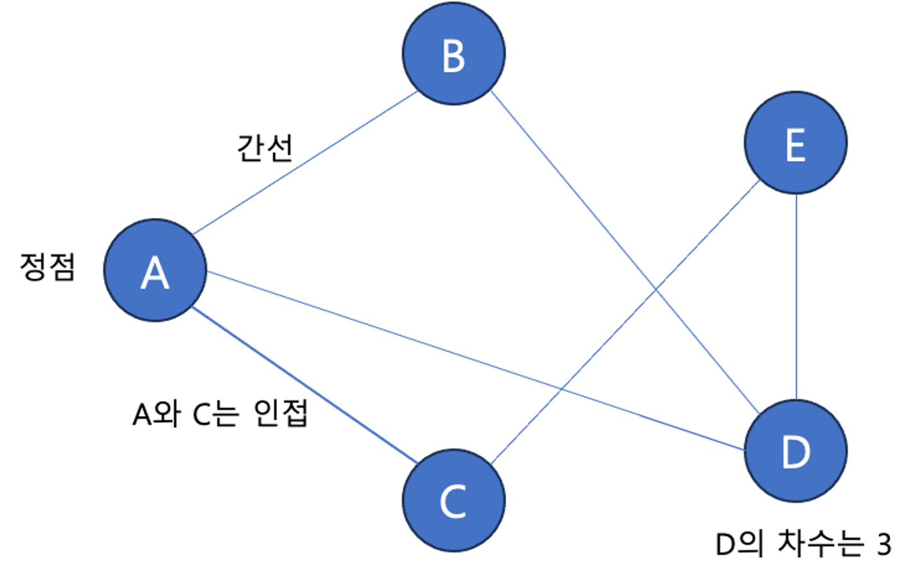
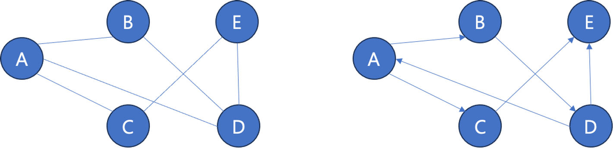
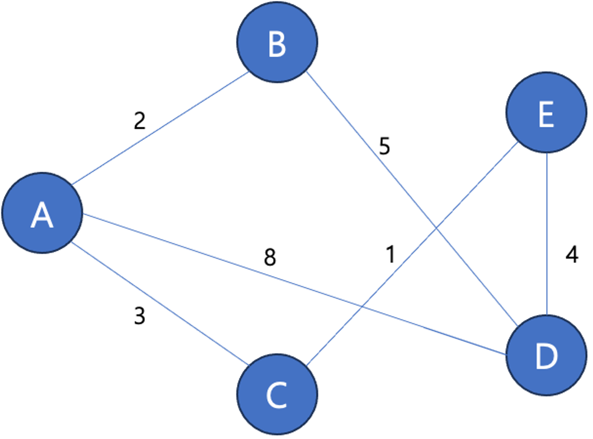
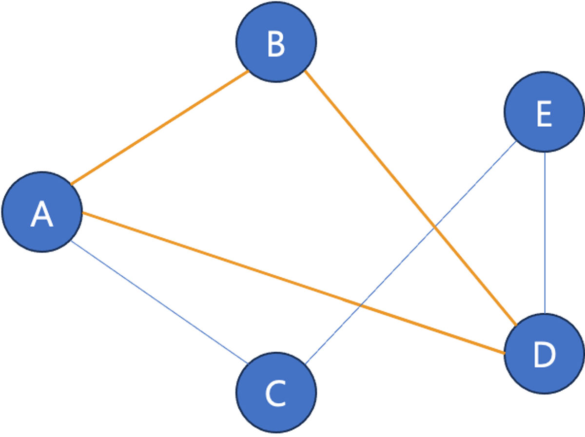
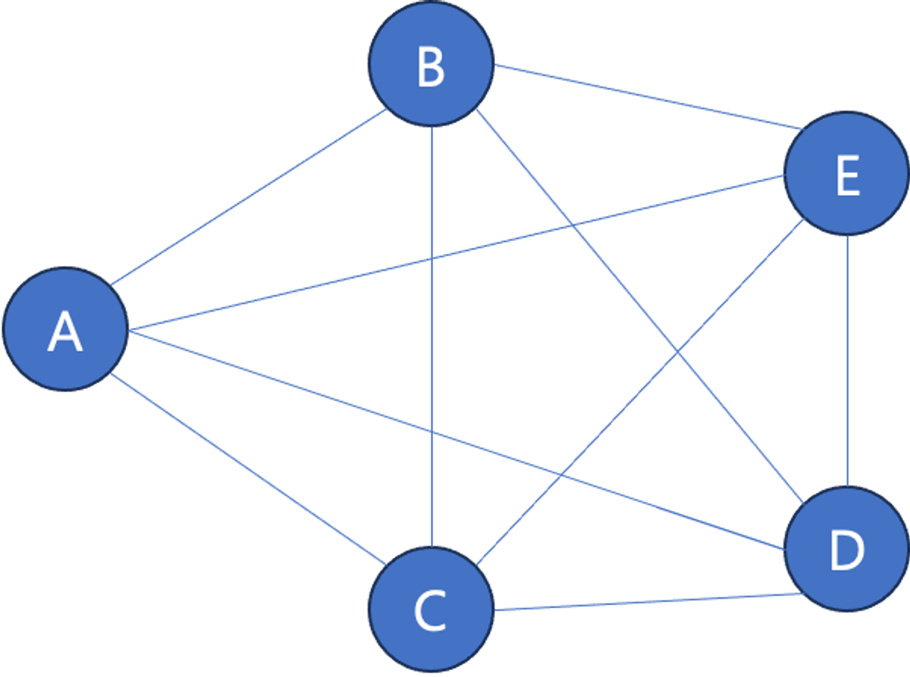
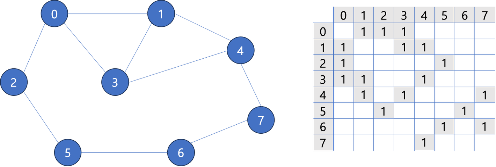
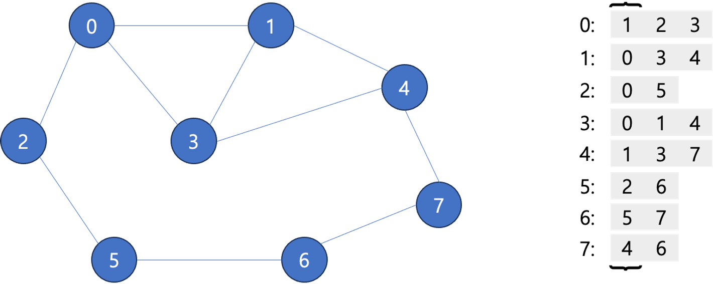
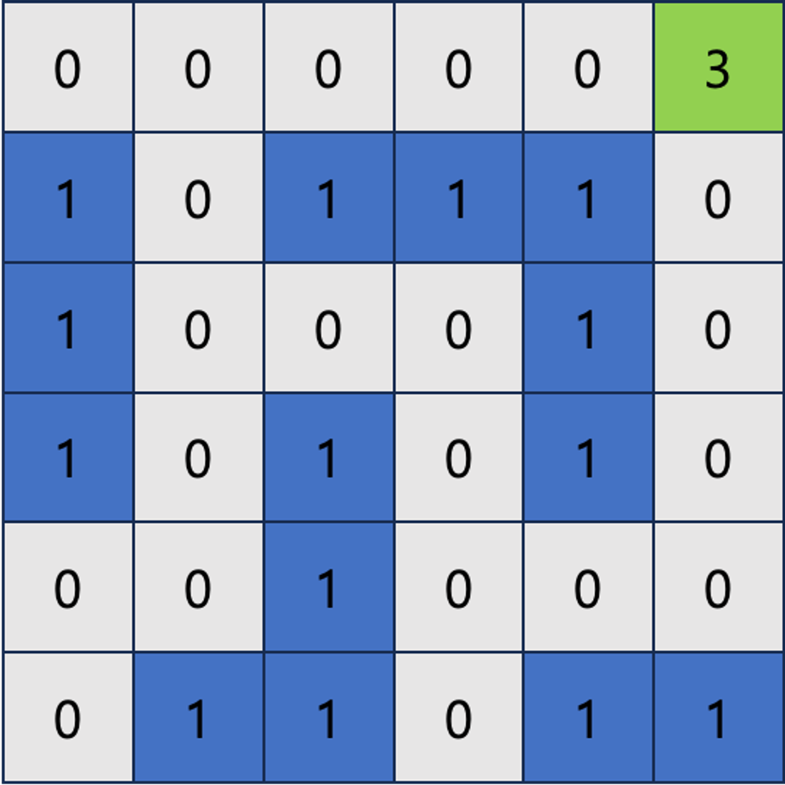

## Graph
- 아이템(사물 또는 추상적 개념)들과 이들 사이의 연결 관계를 표현한 자료구조
  - 정점(Vertex)의 집합과 이들을 연결하는 간선(Edge)로 구성
  - 선형 자료구조나 트리로 표현하기 어려운 M:N 관계를 표현하기 위해 주로 사용

### 그래프 정의
- 정점(Vertex) : 그래프에서 데이터가 담긴 부분을 의미
- 간선(Edge) : 정점간의 연결관계를 표현
- 정점과 정점을 연결하는 간선이 있을 때, 이를 인접(adjacent)한다고 표현
- 하나의 정점에 연결된 간선의 수를 차수(degree)라고 표현   

- 경로(Path) : 정점을 통해 연결되는 간선들을 순서대로 나열한 것
  - 단순 경로 : 한 정점을 최대 한번만 지나는 경로


### 그래프 종류
- 무향 그래프(Undirected Graph) vs 유향 그래프(Directed Graph)

- 유향 그래프
  - 간선이 방향을 가져서 한쪽 정점에선 다른 정점에 도달할 수 있지만, 반대 방향으로는 도달할 수 없는 간선으로 구성된 그래프
- 무향 그래프
  - 양쪽 정점에서 간선을 통해 도달하는 것이 자유로운 그래프



- 가중치 그래프(Weighted Graph)
  - 간선에 값을 추가한 그래프
  - 해당 간선을 택할 때 비용을 표현하는 경우
  - 최단 거리를 구하는 문제 등에서 활용



- 시작한 정점에서 끝나는 경로를 사이클(순환)이라고 함
- 순환 구조를 가진 그래프
- A - B - D - A


- 정점들이 가능한 모든 간선을 가진 그래프


### 그래프의 표현
#### [인접행렬](AdjMatrix.java)
- 정점의 갯수를 V라고 할때, V * V 크기의 2차원 배열 활용하여 간선 정보를 저장하는 방식
- 행 번호와 열 번호를 각각 그래프의 정점에 대응
- 두 정점이 인접하면 1, 아니면 0
- 단점: **정점의 갯수가 많고 간선의 갯수가 적을 때 불필요한 공간이 많이 낭비**



#### [인접리스트](AdjList.java)
- 각 정점에 대한 인접 정점들을 리스트로 저장하는 방식



### 그래프 탐색
#### DFS(깊이 우선 탐색) 복습
- 루트 노드에서 시작하여 한 방향으로 갈 수 있는 경로가 있는 곳까지 깊이 탐색해 가다가 더 갈곳이 없을 때까지 탐색
- 갈곳이 없어지면 가장 마지막 갈림길로 돌아와 다른 정점을 탐색
- 가장 마지막에 만났던 갈림길의 노드로 되돌아가서 다시 깊이 우선 탐색을 반복해야 하므로 후입선출 구조의 Stack을 많이 활용
- 함수의 호출과 복귀를 관리하기 위해 컴퓨터는 시스템 Stack을 활용
  - 재귀함수를 사용하여 DFS를 구현할 경우 더 간단하게 구현 가능


#### BFS(너비 우선 탐색) 복습
- 루트 노드의 자식 노드 또는 인접한 장점들을 모두 차례로 방문
- 방문했던 자식 노드들을 시작점으로 다시 인접한 정점들을 차례로 방문
- 선입 선출 형태의 자료구조인  Queue를 많이 활용
- 인접한 노드들부터 차례대로 방문을 하기 때문에 시작 정점과 끝 정점 사이의 최단 거리를 구하는데 유용

#### 인접 행렬, 인접 리스트 만들기
- 인접 행렬 만들기
  ```java
  BufferedReader reader = new BufferedReader(new InputStreamReader(System.in));
  String[] info = reader.readLine().split(" ");
  int maxNodes = Integer.parseInt(info[0]);
  
  int[][] adjMap = new int[maxNodes + 1][maxNodes + 1];
  int edges = Integer.parseInt(info[1]);
  for (int i = 0; i < edges; i++) {
      String[] edgeInfo = reader.readLine().split(" ");
      int leftNode = Integer.parseInt(edgeInfo[0]);
      int rightNode = Integer.parseInt(edgeInfo[1]);
      adjMap[leftNode][rightNode] = 1;
      adjMap[rightNode][leftNode] = 1;
  }
  ```
  
- 인접 리스트 만들기
  ```java
  BufferedReader reader = new BufferedReader(new InputStreamReader(System.in));
  String[] info = reader.readLine().split(" ");
  int maxNodes = Integer.parseInt(info[0]);
  
  List<List<Integer>> adjList = new ArrayList<>();
  for (int i = 0; i < maxNodes; i++) {
      adjList.add(new ArrayList<>());
  }
  
  int edges = Integer.parseInt(info[1]);
  for (int i = 0; i < edges; i++) {
      String[] edgeInfo = reader.readLine().split(" ");
      int leftNode = Integer.parseInt(edgeInfo[0]);
      int rightNode = Integer.parseInt(edgeInfo[1]);
      adjList.get(leftNode).add(rightNode);
      adjList.get(rightNode).add(leftNode);
  }
  ```
- 재귀 함수를 이용한 DFS
  ```java
  public void recursive(
          int next,
          int maxNodes,
          int[][] adjMap,
          boolean[] visited,
          List<Integer> visitOrder
  ) {
      visited[next] = true;
      visitOrder.add(next);
      for (int i = 0; i < maxNodes; i++){
          if (adjMap[next][i] == 1 && !visited[i]) {
              recursive(i, maxNodes, adjMap, visited, visitOrder);
          }
      }
  }
  ```
  
### 델타 탐색 DFS, BFS
- 실제 문제에서는 정점들의 연결 관계가 아닌 2차원 배열이 주어지기도 함
  - 미로 탐색 예시
  - 매 칸마다 다음에 도달 가능한 정점들을 판단하는 것이 중요
  - 델타 탐색



- 이차원 배열로 지도가 표현되어 있고, 시작점에서 끝점까지 걸리는 최단 거리를 구하는 문제
- BFS의 논리로 풀게 되지만, 일반적인 그래프를 인접 행렬 / 인접 리스트로 표현하는 것과는 다르게 각각 위치에서 주변의 4칸 이동이 가능한지 여부를 판단하면서 풀어야 함
- 현재 위치에서 위 / 아래 / 왼쪽 / 오른쪽에 해당하는 X와 Y의 차이(델타)를 이용해서 다음 좌표를 선정하면 편하게 위치 지정 가능
```java
                //      좌, 우, 아래, 위
private final int[] dx = {-1, 1, 0, 0};
private final int[] dy = {0, 0, -1, 1};
```
- 실제 미로는 `int[][]`와 같은 방식으로 만들어지는데, 각 좌표에 도달한 적이 있는지 판단하기 위한 `boolean[][]`을 같이 생성
- BFS를 진행하면서
  1. 다음 위치가 범위 내에 있는지 (가로, 세로를 벗어나지는 않는지)
  2. 벽이 아닌 이동할 수 있는 공간인지
  3. 방문한 적 있는 공간인지
- 를 판단하며 Queue에 다음 위치를 입력
- 문제가 최단 거리 인지, 도달 가능성에 대한 건지에 따라 Queue에 담기는 데이터의 형식이 달라짐
  - 도달 가능성: Queue가 완전히 빌때까지 반복하면서, 목표 지점에 도달했는지 여부만 판단하면 되기 때문에, Queue에도 방문할 위치만 담기면 됨
  - 최단 거리 문제: 현재 지점까지 오는데 얼마나 걸렸는지에 대한 데이터가 Queue에 함께 포함되어야 하며, 다음에 Queue에 데이터를 넣는 과정에서 그 데이터를 하나씩 증가시켜야 함
```java
public class Maze {
    private final int[] dx = {-1, 1, 0, 0};
    private final int[] dy = {0, 0, -1, 1};

    public void solution(int[][] maze) {
        Queue<int[]> visitNext = new LinkedList<>();
        boolean[][] visited = new boolean[6][6];
        visitNext.add(new int[]{5, 0, -1});
        int min = -1;
        while (!visitNext.isEmpty()) {
            int[] next = visitNext.poll();
            int nowX = next[0];
            int nowY = next[1];
            int steps = next[2];
            if (maze[next[0]][next[1]] == 3){
                min = next[2] + 1;
                break;
            }

            for (int i = 0; i < 4; i++) {
                int nextX = nowX + dx[i];
                int nextY = nowY + dy[i];
                if (
                        checkBounds(nextX, nextY) &&
                        (maze[nextX][nextY] == 0 || maze[nextX][nextY] == 3) &&
                        !visited[nextX][nextY]
                ) {
                    visited[nextX][nextY] = true;
                    visitNext.offer(new int[]{nextX, nextY, steps + 1});
                }
            }

        }
        System.out.println(min);
    }

    public boolean checkBounds(int x, int y) {
        return
                -1 < x && x < 6 &&
                -1 < y && y < 6;
    }

    public static void main(String[] args) throws IOException {
        new Maze().solution(new int[][]{
                {0, 0, 0, 0, 0, 3},
                {1, 0, 1, 1, 1, 0},
                {1, 0, 0, 0, 1, 0},
                {1, 0, 1, 0, 1, 0},
                {0, 0, 1, 0, 0, 0},
                {2, 1, 1, 0, 1, 1}
        });
    }

}
```