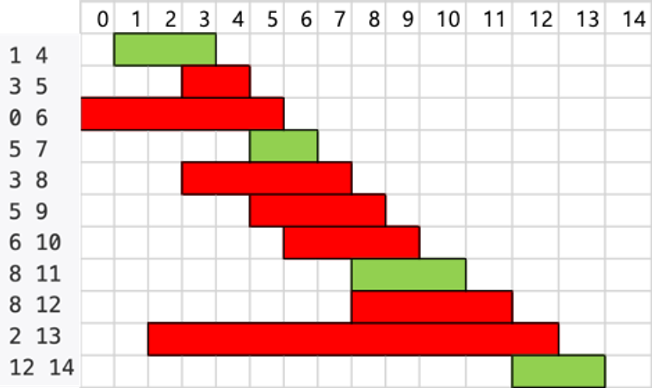
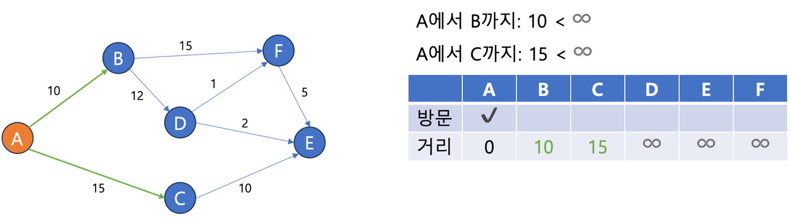

## Greedy
### 거스름돈 문제
- 손님이 지불한 금액에 대해 거스름돈을 주어야 하는 상황
  - 총 거슬러 주어야 하는 금액은 2460원
  - 가지고 있는 동전은 500, 100, 50, 10원
  - 종류별로 동전은 무한정 사용 가능하다고 가정
  - 가장 적은 동전을 사용해서 거스름돈을 거슬러 주려면?

### 탐욕 알고리즘
- Greedy - 탐욕 스러운
- 답을 도출하기 위해 선택을 해야할 때, 현재 가장 최선인 답안을 고르는 알고리즘 기법
1. 거스름돈의 총량을 가장 크게 줄이기 위해서 가장 큰 금액의 동전 선택
2. 만약 거슬러준 금액이 거슬러 줘야 하는 금액을 넘어선다면, 그보다 한단계 작은 동전 선택
3. 모든 금액을 거슬러 줄 떄까지 반복


- 탐욕 알고리즘은 일반적으로 최적화 문제, 가능한 값들 중에서 가장 크거나 작은 값을 찾는데 많이 활용
> ❗ 탐욕 알고리즘으로 만들어진 결과가 항상 최적이라는 보장이 없음

- 탐욕 알고리즘으로 정답을 구할 수 있는 경우
1. 탐욕적 선택 속성 - 여태까지 선택한 결과가 현재의 선택에 영향을 미치지만, 미래의 선택은 현재의 선택에 영향을 미치지 않음 => 선택을 재고하지 않아도 최적 해를 구할 수 있음
2. 최적 부분 구조 - 매번 선택한 결과(부분 문제의 답)가 최적 해의 일부분이 되는 경우

### Knapsack Problem
- 가방에 넣을 수 있는 총 무게가 정해져 있고, 
- 가방에 넣을 수 있는 물건들의 가치와 무게가 존재할 때 가방에 넣을 수 있는 만큼 물건을 최대한 넣는 문제
  - 하나의 물건을 
    - 쪼갤 수 있음 / Fractional Knapsack 문제 : 탐욕 알고리즘 기법으로 풀 수 있음 
    - 쪼갤 수 없음 / 0 - 1 Knapsack 문제 : 탐욕 알고리즘 기법으로 풀 수 없음


### 활동 선택 문제
- [회의실 배정](https://www.acmicpc.net/problem/1931)은 활동 선택 문제라고 부르는 또다른 대표적인 탐욕 알고리즘 문제
- 기본적으로 시작 시간과 종료 시간이 주어진 다수의 활동들을 기준으로, 한번에 하나의 활동을 할 수 있다고 가정
- 최대한 많은 활동을 진행하는 문제
1. 활동들을 종료시간을 기준으로 오름차순으로 정렬
2. 선택할 수 있는 활동 중 종료 시간이 가장 빠른 활동을 우선 선택
3. 2번을 반복하되, 시작 시간이 현재 선택된 가장 늦은 종료 시간 이후의 활동을 선택
4. 모든 활동을 다 검사한 후 종료

```java
import java.io.BufferedReader;
import java.io.IOException;
import java.io.InputStreamReader;
import java.util.Arrays;
import java.util.StringTokenizer;

public class Main {
    public int solution() throws IOException {
        BufferedReader reader = new BufferedReader(new InputStreamReader(System.in));
        int meetingCount = Integer.parseInt(reader.readLine());
        int[][] meetings = new int[meetingCount][2];
        for (int i = 0; i < meetingCount; i++) {
            StringTokenizer tokenizer = new StringTokenizer(reader.readLine());
            meetings[i][0] = Integer.parseInt(tokenizer.nextToken());
            meetings[i][1] = Integer.parseInt(tokenizer.nextToken());
        }

        Arrays.sort(meetings, ((o1, o2) -> {
            if (o1[1] != o2[1]) return o1[1] - o2[1];
            return o1[0] - o2[0];
        }));

        int answer = 0;
        int lastEnd = 0;
        for (int i = 0; i < meetingCount; i++) {
            if (meetings[i][0] >= lastEnd) {
                answer++;
                lastEnd = meetings[i][1];
            }
        }

        return answer;
    }

    public static void main(String[] args) throws IOException {
        System.out.println(new Main().solution());
    }
}
```

### 💡[Dijkstra Algorithm](Dijkstra.java)💡
- 유향 가중치 그래프에서 하나의 시작 정점에서 다른 정점으로 도달하는 최단 경로를 구하는 알고리즘
- 매번 가장 가까운 정점을 선택하는 탐욕 알고리즘 기법을 통해 만들어진 알고리즘
- 관점에 따라 동적 계획법으로 생각되기도 하는데, 선택된 결과에 따라 정보를 지속적으로 수정하는 동적 계획법의 모습도 가지고 있기 때문

1. 시작 정점을 결정하고, 시작 정점부터 다른 모든 정점들 사이의 거리를 무한대로, 시작 정점까지의 거리는 0으로 초기화
2. 아직 방문하지 않은 정점들 중 현재 도달 가능한 가장 가까운 정점을 선택하고 방문(첫 방문은 시작 정점)
3. 방문한 정점에서 도달 가능한 주변 정점들까지의 거리를 갱신
  - `현재 정점까지 최단 거리 + 주변 정점까지의 거리`
  - `현재 기록된 주변 정점까지의 거리` 중 작은 것
4. 모든 정점에 방문할 떄까지 2~3번 반복


- 다익스트라 알고리즘은 음의 가중치를 가진 그래프에 대해서는 사용 불가