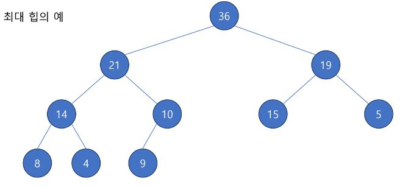
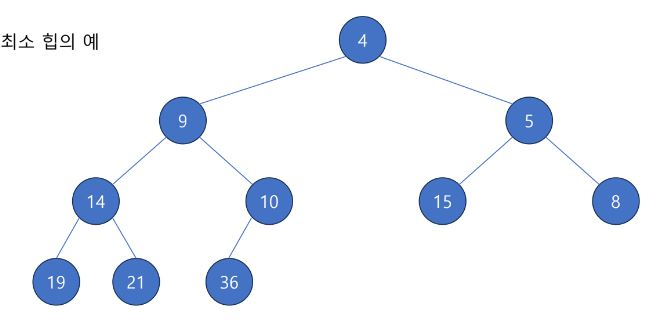

## Heap
- 특수한 형태의 [완전 이진 트리](/Algorithm/Tree/README.md#완전-이진-트리---complete-binary-tree)
- 완전 이진 트리의 어떤 노드 C와 부모 노드 P가 있을 때,
  - C의 값보다 P의 값이 항상 크거가
  - C의 값보다 P의 값이 항상 작을 때
- 이 트리를 **힙(Heap)** 이라고 부름
- 다양한 요소를 가지고 있는 집합에 대해, 가장 큰 값이나 가장 작은 값을 찾기 용이
  - **우선순위 큐**를 만드는데 유용하게 사용

- 최대 힙의 예   

- 최소 힙의 예   

## 힙 삽입 연산
1. 제일 왼쪽 아래에 원소를 삽입 (완전 이진 트리 조건)
2. 새로 삽입한 원소를 부모 노드와 비교 
   - 힙의 조건을 만족시키지 못하게 배치된 경우 서로 교환
3. 새로 추가한 원소가 루트 원소가 되거나, 힙의 조건을 만족시킬 때 까지 반복

## 힙 삭제 연산
1. 힙의 루트 원소를 제거
2. 루트 원소의 위치에 힙의 마지막 원소를 배치(완전 이진 트리 조건)
3. 루트 원소와 자식 원소들을 비교 
   - 힙의 조건을 만족시키지 못하게 배치된 경우 서로 교환
   - 만일 둘다 조건을 만족시키지 못하는 경우 만족시킬 수 있는(더 크거나(max heap), 작은(min heap)) 값과 교환
4. 교환이 일어났다면 다시 자식 노드들과 비교

## Heap Sort
- Heap의 특성을 사용해서 정렬하는 알고리즘
- 방법 1: 그냥 힙어 다 넣었다가 빼기
- 방법 2: 주어진 배열을 최대 힙으로 변환한 다음, 제일 큰 원소를 반복해서 뒤로 보내기
- 최악의 경우가 항상 O(n log n)이며, 병합 정렬과 같은 추가 데이터 할당이 필요 없음

## [Heapify](/Algorithm/Heap/BinaryMaxHeap.java)
- 주어진 배열을 힙의 형태로 변환하는 과정
1. 자식을 가지고 있는 가장 높은 레벨의 노드의 위치부터 시작
2. 노드와 자식 노드들의 관계가 힙 속성을 만족하도록 교환을 진행 (siftDown)
3. 이후 보다 상위 노드들에서 반복

