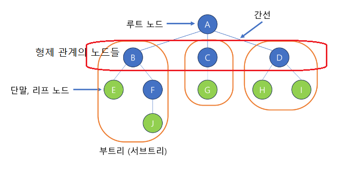
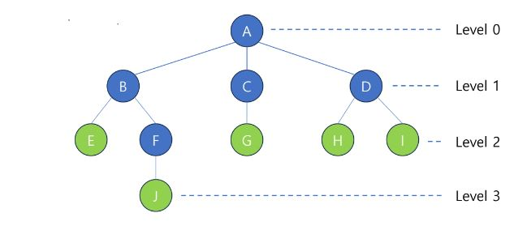
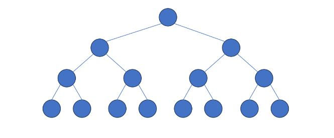
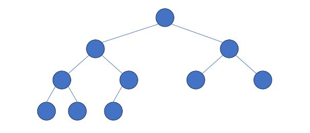
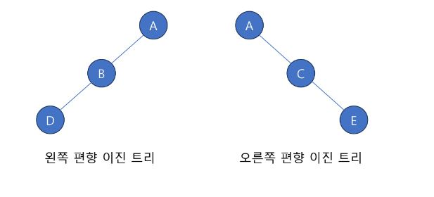
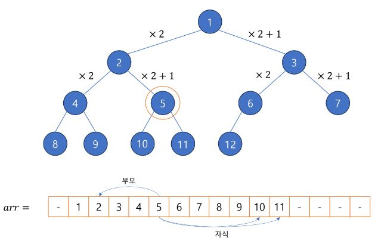
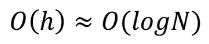
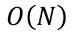

## Tree
- 원소들 간에 1:N 관계를 가지는 비선형 자료구조
  - 상위 원소와 하위 원소의 관계가 있는 계층적 자료구조
  - 하위 원소로 내려가면서 나무의 가지가 자라나는 모습에서 Tree라는 이름이 붙었음

> 💡 선형 자료구조 ( <-> 비선형 자료구조)   
> Stack: LIFO
> Queue: FIFO

- 한 개 이상의 노드로 이루어진 유한 집합
  - 각각 데이터를 담고 있는 원소를 노드 또는 정점이라고 함
  - 노드 중 최상위 노드는 루트(root) 노드
  - 각 노드는 0개 이상의 자식 노드를 가질 수 있음
  - 하나의 부모에 여러 자식이 연결되어 있음
  - 하나의 자식은 둘 이상의 부모를 가질 수 없음
  - 노드의 갯수가 N개 일때, N-1개의 간선을 가지고 있음 ( => 그래서 순환 구조가 생기지 않음!)
- 형제 노드
  - 같은 부모 노드를 가진 노드들
- 조상 노드
  - 간선을 따라 루트 노드까지 가는 경로의 모든 노드들
  - J의 조상 노드들 : A, B, F
- 차수 (Degree)
  - 노드에 연결된 자식 노드의 수
    - A의 차수: 3, B의 차수 : 2
- 트리의 차수
  - 트리 노드들의 차수 중 제일 큰 값   

- 높이(Level)
  - 루트에서 노드에 이르는 간선의 수
- 트리의 높이
  - 노드 중 높이가 가장 큰 값

## 이진 트리 - Binary Tree
- 트리 중에서 모든 부모 노드가 최대 2개의 자식 노드를 가진 트리
- 높이가 H인 이진 트리에서
  - 레벨이 i인 노드의 갯수는 최대 2^i
  - 트리 전체의 노드의 최소 갯수는 H + 1, 최대 갯수는 2^(H+1) -1

## 포화 이진 트리 - Perfect Binary Tree
- 모든 레벨에 노드가 최대로 차 있는 이진 트리
  - 높이가 H인 트리에서 최대의 노드 갯수(2^(H+1) - 1)을 가짐   

## 완전 이진 트리 - Complete Binary Tree
- 제일 깊은 레벨을 제외한 레벨에 노드의 갯수가 최대로 차있고,
- 마지막 레벨에 노드가 존재할 경우 왼쪽부터 차례대로 채워 넣어진 이진 트리   

## 편향 이진 트리 - Skewed Binary Tree
- 높이가 H일때, 이진트리가 가질 수 있는 최소의 노드 갯수를 가지며,
- 한쪽 방향의 자식 노드만 가진 이진 트리   

## 이진 트리 배열로 표현하기

- 이진트리는 배열로 쉽게 표현 가능
- 현재 노드가 i일때
  - 왼쪽 자식 노드 : i * 2
  - 오른쪽 자식 노드 : i * 2 + 1
  - 부모 노드 : i / 2 (소수점 버림)
- 단점: 편향 이진 트리의 경우 공간 낭비가 심함

## 이진 트리 순회
- 이진 트리의 각 노드를 한번씩만 방문하는 체계적인 방법
  - 루트 노드(V), 왼쪽 서브트리(L), 오른쪽 서브트리(R)를 정해진 순서대로 순회
- 전위 순회 (VLR)
  - 루트 노드 => 왼쪽 서브트리 => 오른쪽 서브트리

- 중위 순회 (LVR)
  - 왼쪽 서브트리 => 루트 노드 => 오른쪽 서브트리

- 후위 순회 (LRV)
  - 왼쪽 서브트리 => 오른쪽 서브트리 => 루트 노드

> 💡 [재귀적으로 구현 가능](TreeArray.java)

## 이진 탐색 트리 - Binary Search Tree
> 💡 [이진 탐색 트리 구현](BinarySearchTree.java)
- 탐색 작업을 효율적으로 하기 위한 자료구조
  - 모든 노드의 데이터가 서로 다른 이진 트리
  - 어느 노드에게 자식이 있는 경우
    - 왼쪽 자식의 데이터는 부모 보다 작음
    - 오른족 자식의 데이터는 부모 보다 큼

- 루트 노드 기준으로
  - 왼쪽 서브트리의 모든 데이터는 루트 노드보다 작음
  - 오른쪽 서브트리의 모든 데이터는 루트 노드보다 큼
  - 중위 순회할 경우, 오름차순 정렬된 데이터를 얻을 수 있음

- 탐색
  - 루트 노드와 탐색 데이터 비교
  - 데이터가 더 작을 경우 왼쪽 서브트리로
  - 데이터가 더 클 경우 오른쪽 서브트리로   
   
  - 편향 이진 트리의 경우   
  

- 삽입
  - 탐색 과정을 따라감
  - 탐색에 성공할 경우 삽입 불가
  - 탐색에 실패하는 시점에 새로운 노드로 데이터 추가

- 삭제
  - 삭제할 데이터를 가진 노드를 탐색
  - 삭제할 노드가 단말 노드면 삭제(링크 해제)
  - 삭제할 노드에 자식이 하나일 경우 부모와 대신 연결
  - 자식이 두개일 경우,
    - 왼쪽 서브트리의 값 중 제일 큰 노드 / 오른쪽 서브트리의 값 중 제일 작은 노드 중 하나와 교체