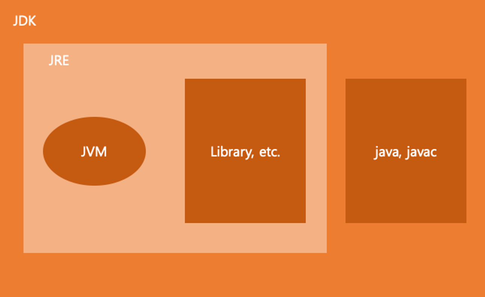

## Java 개요
### 프로그래밍 언어
- Low Level Language
    - 기계어 : CPU가 입력 받아 해석할 수 있는, 0과 1로 이뤄진 명령어
    - 어셈블리어 : 기계어와 대응되는, 인간이 읽을 수 있는 형태의 프로그래밍 언어
    - 특징
        - 가독성이 매우 떨어짐
        - 컴퓨터 구조에 대한 지식이 해박해야 사용할 수 o
        - 사용하는 컴퓨터(CPU)에 따라 작성해야 하는 코드가 다름

- High Level Language
    - 특징
        - 일반적으로 인간이 이해하기 더 편하고, 가독성이 높다.
        - 많은 단계에 추상화가 이뤄져서 컴퓨터 구조에 대하야 비교적 알아야 할 내용이 적다.
        - 생산성이 높아짐
        - CPU가 직접 실행 할 수 x
            - Java를 비롯한 High Level Language로 작성된 코드는 어느 시점에서 다시 기계어로 변환이 필요
            - 변환 시점은 언어마다 다름
                - ex) C++ : 컴파일 언어, Java : 스크립트 언어

---
### Java
#### Java와 JVM

- Java 언어의 모토 = Write Once Run Anywhere
  - 한번 작성한 코드를 어떤 컴퓨터에서도 실행하는 것이 목표
  - Java 컴파일 => Java Bytecode가 나옴
  - Java Bytecode는 JVM을 위한 어셈블리어
  - 즉, Java는 JVM(Java Virtual Machine) 위에서 동작
  - JVM은 Java Bytecode를 CPU가 이해할 수 있는 기계어로 번역
  

- JDK (Java Development Kit)
    - Java를 개발하기 위한 도구 모음집
    - Java 언어를 Java Bytecode로 변환하는 컴파일러(javac)가 포함되어 있음
    - Java Bytecode를 실행해보기 위한 JVM 포함

- JRE (Java Runtime Environment)
  - Java를 실행하기 위한 JVM과 해당 JVM이 사용할 라이브라리를 포함한 Java로 작성된 프로그램의 실행환경
  - 프로그램 실행을 위한 것들만 따로 모아 놓은 것