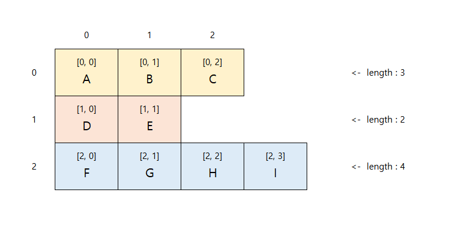

## 배열(Array)
- 변수는 하나의 데이터만 저장
- 배열은 하나의 변수에 여러 데이터를 저장하기 위해 사용
- 같은 타입의 데이터들을 하나의 변수에 저장
```java
int[] scores = {65, 75, 85};
```

### 배열 선언
- 변수를 선언할 때, 자료형 뒤에 `[ ]`를 덧붙여 선언
- 그 뒤 `{ }` 안에 저장할 값들을 나열
- 다시 가져올 때는 변수에 `[ ]`를 이용하며 안에 몇 번째 값을 가져올지 결정
  - index는 0부터 시작
  - 내부의 개별 데이터를 바꿔줄 수도 있음
- 배열 생성과 동시에 초기화
```java
int[] scores = {65, 75, 85};
scores[1] = 80; // 75 -> 80
```

- 배열을 먼저 만들고 데이터 개별 할당 가능
```java
String[] names = new String[4];
names[0] = "alex";
System.out.println(names[0]);
```

- 배열의 크기를 변수로 전달 가능
```java
int students = 10;
String[] names = new String[students];
int[] scores = new int[students];
```

---
### 배열의 크기

- 배열의 크기는 배열.length로 알아낼 수 있음
```java
int numOfStudents = studentNames.length;
System.out.println(numOfStudents);
```
- 1차원 배열과 문자열의 크기
```java
public class Array{
    public static void main(String[] args) {
        int[] arr = {1,2,3};
        String str = "abcde";
        System.out.println(arr.length); // 3
        System.out.println(str.length()); // 5
    }
}
```
- 배열.length는 ( ) 괄호를 붙이지 않고
- 문자열.legnth()는 ( ) 괄호를  붙여 주어야 한다.
---
- 2차원 배열의 크기


- row(행)와 column(열)을 가지고 있고
  row가 각각 다른 개수의 column을 가지고 있을 때
  ***가변길이 배열(Jagged Array)*** 라고 한다.


- 첫번쨰 row는 3개의 column을,
- 두번쨰 row는 2개의 column을,
- 세번째 row는 4개의 column을 가지고 있다.

1. row길이, 각 row별 원소 갯수(= column의 길이) 구하기

```java
public class ArrayLength {
    public static void main(String[] args) {
        String[][] arr = {
                {"A","B","C"},
                {"D","E"},
                {"F","G","H","I"}
        };
        // row의 길이
        System.out.println(arr.length); // 3
        
        // 각 row의 column 길이
        System.out.println(arr[0].length);  // 3
        System.out.println(arr[1].length);  // 2
        System.out.println(arr[2].length);  // 4
    }
}
```

2. 반복문을 사용하여 row별 원소의 갯수(= column의 길이) 구하기
```java
public class ArrayLength {
    public static void main(String[] args) {
        String[][] arr = {
                {"A","B","C"},
                {"D","E"},
                {"F","G","H","I"}
        };
        // row의 길이
        System.out.println(arr.length); // 3
        
        // 각 row의 column 길이
        for (int i = 0; i < arr.length ; i++) {
            System.out.println(arr[i].length);
        }
    }
}
```
