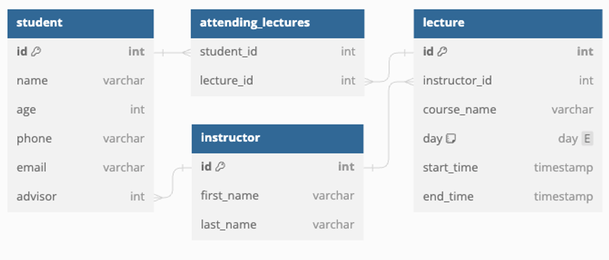

## JPA
### ManyToOne & OneToMany
### Entity 관계 설정


왼쪽 테이블의 제조사 ID는 오르쪽 테이블의 ID를 의미
- 자신의 테이블이 아닌 테이블의 Key
- 외부의 키,외래키(Foreign Key)

### RDB에서의 관계
> 💡 RDB : Relational Database / 관계형 데이터베이스
1. 1:1 - One to One Relationship
- 한 테이블의 레코드 하나가 다른 테이블의 레코드 하나와 연관된 관계
- 특정 데이터를 성능 또는 보안적 측면에서 나눌 때 사용
- 보통은 Foreign Key 컬럼에 Unique 제약 사항을 적용함으로서 구현

2. N:1 - Many to One
- 한 테이블의 레코드 0개 이상이 다른 테이블의 레코드 하나와 연관된 관계
- 일반적인 데이터베이스의 가장 흔한 관계 ( 게시글 - 댓글 , 가게 - 상품 )
- 하나의 레코드 쪽 테이블의 입장에서 표현할 경우 One to Many로 표현

3. M:N - Many to Many
- 한 테이블의 레코드 0개 이상이 다른 테이블의 게코드 0개 이상과 연관된 관계
- 양쪽 테이블의 PK를 Foreign Key로 가진 제 3의 테이블 생성
- Join Table, Associative Table라고 부름
---
### ORM -JPA
하나의 테이블에는 다른 테이블의 레코드를 넣지 못함
- 그래서 테이블 데이터를 표현하기 위해 ORM 등장
- ORM을 사용하면 테이블간 관계를 Entity의 필드로 표현 가능
```java
@Entity
public class Article {
    private String title;
    @Lob
    private String content;

    // 아래 User와 Comment는 다른 Entity 클래스 입니다.
    private User writer;
    private List<Comment> comments;
}
```
----
### Student - Lecture - Intstructor ERD

- `student` 테이블과 `instructor` 테이블이 N : 1 관계
### `@ManyToOne`
```java
// Student Entity
@Data
@Entity
public class Student {
    @Id
    @GeneratedValue(strategy = GenerationType.IDENTITY)
    private Long id;

    private String name;
    private Integer age;
    private String phone;
    private String email;
}
```
```java
// Instructor Entity
@Entity
public class Instructor {
    @Id
    @GeneratedValue(strategy = GenerationType.IDENTITY)
    private Long id;
    private String firstName;
    private String lastName;

}
```
- 실제 테이블에는 `student` 테이블에 `advisor_id`가 포함될 예정
- 여러 `Student` Entity가 `Instructor` Entity와 연관 될 수 있기 때문
- `Student` Entity에 `Instructor` Entity를 포함 시키고 `@ManytoOne` 추가
- 컬럼 이름을 바꾸고 싶을 떄는 `@JoinColumn` 에 name 속성 추가
```java
// Student Entity
@Data
@Entity
public class Student {
    @Id
    @GeneratedValue(strategy = GenerationType.IDENTITY)
    private Long id;

    private String name;
    private Integer age;
    private String phone;
    private String email;
    
    @ManyToOne
    @JoinColumn(name = "advisor")
    private Instructor advisor;
}
```
- 새로운 `Studnet` Entity를 등록할 떄 `Instructor` Entity를 찾아서 배정
```java
@GetMapping("create-view")
public String createView(Model model) {
    model.addAttribute("instructors", instructorRepository.findAll());
    return "student/create";
}
```
- `StudentController.createView` 메서드는 전체 `Instructor` 데이터를 Model에 전달함으로서 사용자가 선택할 수 있는 `Instructor`목록을 `create.html`에서 확인할 수 있도록 전달
- `create.html`
```java
<!DOCTYPE html>
<html lang="en" xmlns:th="http://www.thymeleaf.org/">
<head>
  <meta charset="UTF-8">
  <title>Title</title>
  <style>
    .mb-3 {
        margin-bottom: 1rem;
    }
  </style>
</head>
<body>
  <h1>Create Student</h1>
  <form action="/student/create" method="post">
    <div class="mb-3">
      <label>
        Name: <input type="text" name="name" value="Lorem Ipsum">
      </label>
    </div>
    <div class="mb-3">
      <label>
        Age: <input type="number" name="age" value="25">
      </label>
    </div>
    <div class="mb-3">
      <label>
        Phone: <input type="text" name="phone" value="010-0000-0000">
      </label>
    </div>
    <div class="mb-3">
      <label>
        Email: <input type="text" name="email" value="lorem@gmail.com">
      </label>
    </div>
    <div class="mb-3">
      <label>
        Instructor:
        <select name="advisor-id">
          <option
                  th:each="instructor: ${instructors}"
                  th:value="${instructor.id}"
          >
            [[${instructor.firstName}]] [[${instructor.lastName}]]
          </option>
        </select>
      </label>
    </div>
    <div class="mb-3">
      <input type="submit">
    </div>
  </form>
</body>
</html>
```
- `create.html`의 `select`요소는 전달받은 `Instructor` 데이터를 바탕으로 복수의 `option` 요소를 생성
- 나중에 서버로 전송될 때 `advisor-id`의 이름으로 전송되며
- 이를 `@RequestParam`으로 받을 수도 있음
- 전달받은 `advisor-id`의 값을 바탕으로 `Instructor` 객체를 찾아낸다면 해당 값을 `student`에 할당하여 관계 설정 가능
```java
// Controller.java
@PostMapping("create")
public String create(
        @RequestParam("name")
        String name,
        @RequestParam("age")
        Integer age,
        @RequestParam("phone")
        String phone,
        @RequestParam("email")
        String email,
        @RequestParam("advisor-id")
        Long advisorId
                ) {
                Student student = new Student();
                student.setName(name);
                student.setAge(age);
                student.setPhone(phone);
                student.setEmail(email);
                student.setAdvisor(
                        instructorRepository.findById(advisorId).orElse(null));
                studentRepository.save(student);
                return "redirect:/student/create-view";
                }
```
- 만약 이 `Student` Entity의 `Instructor` 정보를 활용하고 싶다면 `.getInstructor()` 활용
- `.getInstructor()`은 `Instructor` Entity가 등장
- `student.setAdvisor(instructorRepository.findById(advisorId).orElse(null));` : `Instructor` Entity 찾아서 할당 후 `save()`
---
### `@OneToMany`
- `Instructor`의 `Student` 정보가 알고 싶을 때
- `Instructor`의 PK를 기준으로 `Student`테이블의 FK를 검색
- 비슷하게 `JpaRepository`에 Query Method 추가도 가능
```java
public interface StudentRepository extends JpaRepository<Student, Long> {
    List<Student> findAllByAdvisor(Instructor entity);
    List<Student> findAllByAdvisorId(Long id);
}
```
- `@OneToMany` 추가
```java
@Entity
public class Instructor {
    @Id
    @GeneratedValue(strategy = GenerationType.IDENTITY)
    private Long id;
    private String firstName;
    private String lastName;

    @OneToMany(mappedBy = "advisor")
    private List<Student> advisingStudents;
}
```
- 이떄 `mappedBy` 는 반대쪽 `@ManyToOne` 어노테이션이 붙은 필드의 이름 작성
- 반대쪽(관계의 주가 되는) Entity의 어떤 속성을 기준으로 조회하는지 정의하기 위함
```java
@GetMapping("{id}")
public String readOne(
        @PathVariable("id")
        Long id,
        Model model
) {
    Instructor instructor = instructorRepository.findById(id).orElse(null);
    model.addAttribute("instructor", instructor);
    model.addAttribute("advisingStudents", instructor.getAdvisingStudents());
    return "instructor/read";
}
```