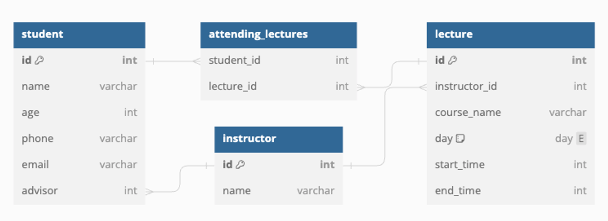

## `@Query`
### `@Query`와 JPQL
- Spring Data JPA의 Query Methods는 간단하면서도 강력한 기능
  - 특별한 코드 없이 메서드의 이름을 바탕으로 조회하는 데이터의 조건 지정 가능
  - 단점
    - 간단한 조건을 제시하는데도 메서드의 이름이 장황해짐
    - 조금 복잡한 조건, 집계 함수 등을 활용하기 어려움


- Query Method 예시
```java
public interface ArticleRepository extends JpaRepository<Article, Long> {
    // 주어진 id보다 id가 큰 가장 첫 게시글
    Optional<Article> findFirstByIdAfter(Long id);
    // 주어진 id보다 id가 가장 작은 게시글을 역순 정렬했을 때 첫 게시글
    Optional<Article> findFirstByIdBeforeOrderByIdDesc(Long id);

    // 주어진 boardId와 일치하며 주어진 id보다 id가 큰 가장 첫 게시글
    Optional<Article> findFirstByBoardIdAndIdAfter(Long boardId, Long id);
    // 주어진 boardId와 일치하며 주어진 id보다 id가 가장 작은 게시글을 역순 정렬했을 때 첫 게시글
    Optional<Article> findFirstByBoardIdAndIdBeforeOrderByIdDesc(Long boardId, Long id);
}
```
---
### Student-Lecture-Instructor Entity / ERD

```java
@Entity
public class Instructor {
    @Id
    @GeneratedValue(strategy = GenerationType.IDENTITY)
    private Long id;

    private String name;

    @OneToMany(mappedBy = "advisor")
    private final List<Student> advisingStudents = new ArrayList<>();
}
```
```java
@Entity
public class Lecture {
    @Id
    @GeneratedValue(strategy = GenerationType.IDENTITY)
    private Long id;

    private String name;
    private String day;
    private Integer startTime;
    private Integer endTime;

    @ManyToOne
    private Instructor instructor;

    @ManyToMany(mappedBy = "attending")
    private final List<Student> students = new ArrayList<>();
}
```
```java
@Entity
public class Student {
    @Id
    @GeneratedValue(strategy = GenerationType.IDENTITY)
    private Long id;

    private String name;
    private Integer age;
    private String phone;
    private String email;

    @ManyToOne
    @JoinColumn(name = "advisor_id")
    private Instructor advisor;

    @ManyToMany
    @JoinTable(
            name = "attending_lectures",
            joinColumns = @JoinColumn(name = "student_id"),
            inverseJoinColumns = @JoinColumn(name = "lecture_id")
    )
    private final List<Lecture> attending = new ArrayList<>();
}
```
---
### `@Query`
- `JpaRepository`를 비롯한 `Repository` 인터페이스 메서드에 붙여서 SQL을 작성할 수 있게 해주는 어노테이션
- JPQL(Java Persistence Query Language) 언어를 기본으로 사용
- SQL과 유사하지만 데이터베이스 테이블과 컬럼 대신 엔티티와 속성을 바탕으로 동작하는 언어
  - => SQL처럼 작성하고, 결과를 다시 Entity 클래스로 받기 가능


- `LectureRepository`에 `@Query`를 추가하여, 12시 이전에 시작하는 `lecture` 반환하는 JPQL
```java
@Query("SELECT l FROM Lecture l WHERE l.startTime < 12")
List<Lecture> findLecturesBeforeLunch();
```
- `lecture` 테이블을 지정하는 대신 조회할 Entity `Lecture`를 지정하고
- `l` 이라는 alias를 부여하고, 변수처럼 가지고 있는 `startTime`속성 사용
- SQL 사용하고 싶을 경우 `nativeQuery`옵션을 `true`로 설정
```java
@Query(
        value = "SELECT * FROM lecture WHERE start_time < 12",
        nativeQuery = true
)
List<Lecture> findLecturesBeforeLunchNative();
```
- 단, SQL을 사용해서 데이터를 조회할 경우 조회된 데이터의 컬럼과 Entity가 일치해야 유연하게 실제 Entity로 반환
- 일부만 조회시 정상적으로 동작하지 않은 가능성 존재
> ⚠️ JPQL을 `@Query`에 넣기만 하면 메서닥 선언된, JpaRepository<T,ID>의 `T`(Entity)와 상관없이, 아무 Entity클래스든 사용 가능 
> 연관성있는 `Repository`에서 작성하는 것을 권장

- `Pageable`과 `Sort`가능
```java
@Query("SELECT l FROM Lecture l WHERE l.startTime < 12")
List<Lecture> findLecturesBeforeLunch(Sort sort);

@Query("SELECT l FROM Lecture l WHERE l.startTime < 12")
List<Lecture> findLecturesBeforeLunch(Pageable pageable);
```
- `nativeQuery`를 사용할 경우 `Sort` 구현 불가능
- `Pageable`의 경우 `countQuery`를 이용해 총 갯수를 반환하는 SQL을 작성함으로서 구현 가능
```java
@Query(
        value = "SELECT * FROM lecture WHERE start_time < 12",
        countQuery = "SELECT count(*) FROM lecture WHERE start_time < 12",
        nativeQuery = true
)
List<Lecture> findLecturesBeforeLunchNative(Pageable pageable);
```