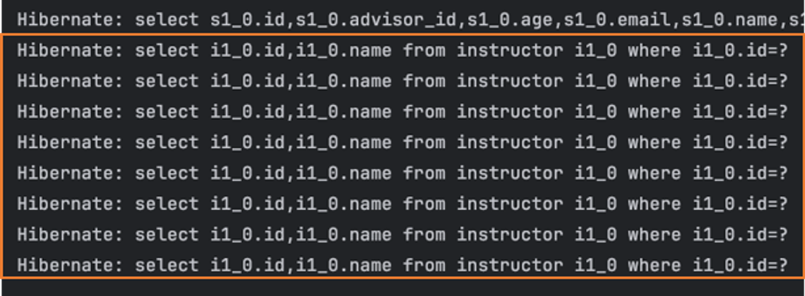
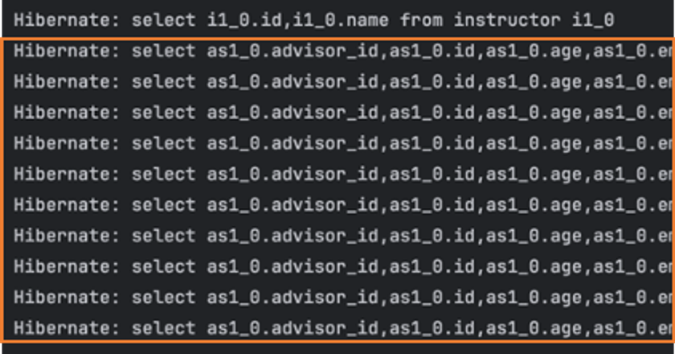

## N + 1 문제
- 기본 해결법 : JOIN FETCH, `@EntityGraph`
- JPA라는 ORM을 사용하기 때문에 간단한 상황에 대해서는 SQL(JPQL)을 작성할 필요 X
- ORM도 데이터베이스와의 소통을 대신할 뿐이기 때문에 어느 시점에서 SQL을 데이터베이스에 전달
- 연관관계를 처리할 때 문제 발생 가능성 있음(ex. `@ManyToMany` 관계를 가진 데이터 전체를 불러올 때)
---
### `Student` , `Instructor`
```java
@Entity
public class Student {
    @Id
    @GeneratedValue(strategy = GenerationType.IDENTITY)
    private Long id;

    private String name;
    private Integer age;
    private String phone;
    private String email;

    @ManyToOne
    @JoinColumn(name = "advisor_id")
    private Instructor advisor;
}
```
```java
@Entity
public class Instructor {
    @Id
    @GeneratedValue(strategy = GenerationType.IDENTITY)
    private Long id;
    private String name;

    @OneToMany(mappedBy = "advisor")
    private final List<Student> advisingStudents 
            = new ArrayList<>();
}   
```
- `spring.jpa.show.sql: true` 설정 시 Hibernate가 실행하는 실제 쿼리문이 보임
```java
// 아무 문제 없을까?
studentRepository.findAll();
```

- `Student`만 조회하려고 하는데 `Instructor`를 조회하기 위한 SQL이 일정량 보임
- 이는 `Student` 내부에 있는 `Instructor`를 찾으려고 하면서 발생
- 영속성 컨텍스트로 인해 이미 한번 조회했던 데이터는 다시 검색하지 않으면서도, 중복되지 않는 `Instructor`만큼 SQL이 실행
---
- 또는 `Instructor`를 `findAll()`로 조회
```java
instructorRepository.findAll();
```
- 처음에는 큰 문제 없이 `Instructor`를 조회하는 쿼리만 보임

- 이 경우는 각각의 `Instructor`를 조회하면서 해당 `Instructor`를 `advisor`로 가진 `Student`를 조회하기 위해서, 
- 각 `Instructor`를 기준으로 `id`를 `advisor_id`로 가지는 `Student`를 조회하는 SQL이 발생

### 연관 관계 조회
- SQL이라면 JOIN을 해서 데이터를 조회할 수 있지만 연관 관계데이터는 항상 필요한게 아님
- JPA와 같은 ORM 기술은 상황에 따라 필요한 데이터를 나중에 조회하드록 만들어지는 경우가 많음
  - JPA의 경우 
    - `@ManyToOne` 관계 Entity는 Proxy 객체
    - `@OneToMany` 관계는 Collection은 `PersistentBag` 객체
  - 각 객체가 실제 데이터 대신 들어가 필요한 시점에서 조회하도록 구성
- => 성능 향상을 위한 기능이 성능을 저하시키는 상황


### N + 1 문제
- 실제 SQL과 ORM 프레임워크가 실제로 발생시키는 N개의 데이터 조회시 N+1번의 쿼리가 실행되는 문제
- 쿼리의 횟수는 성능과 직접적인 연관이 있기 때문에 반드시 잡고 가야 하는 문제

EX) N개의 데이터를 가진 Student를 조회하는 경우   
- 전체 `Student` Entity N개를 조회하는 1번의 쿼리
- `Student`와 연관된 `Instructor`를 위한 N번의 쿼리
```text
Select s From Student; => 1번
Select i From Instructor i Where Student.advisor_id = i.id;
student id 1번의 advisor_id 검색
...
student id n번의 advisor_id 검색 = > n번
---
총 N + 1 번
```
- 총 N + 1번의 쿼리가 실행!
- => 이를 `N + 1 문제` 라고 부름