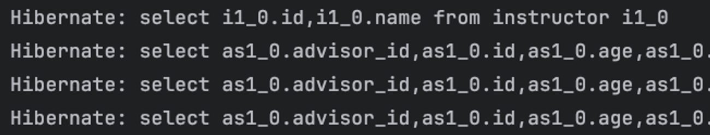
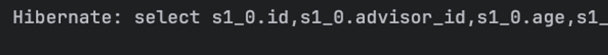
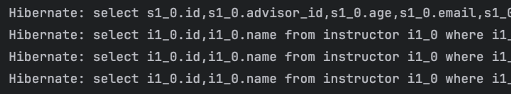
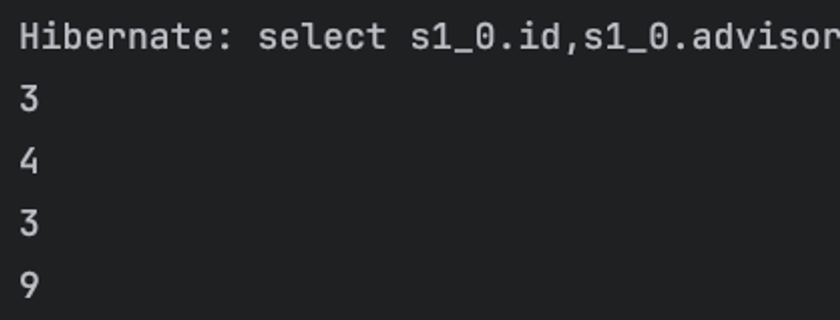

## 즉시 로딩, 지연 로딩
### 로딩 방식
- ORM 프레임워크에서 N+1 문제는 결국 어느 시점에 데이터를 가져오느냐의 문제
- `Student` 전체 조회의 경우 `Instructor`를 사용하지 않아도 필요 이상의 SQL이 발생했지만
- `Instructor`의 경우 `Student`를 사용하는 시점에 실제 문제가 발생
- 이는 `@ManyToOne`과 `@OneToMany`의 `FetchType`, 어느 시점에서 연관 관계의 데이터를 가져올지(로딩)가 서로 다르기 때문
1. 즉시 로딩(Eager Loading) : 최초로 데이터를 조회할 때 연관관게 데이터도 다 가져오는 방식
2. 지연 로딩(Lazy Loading) : 연관 관계 데이터가 필요한 시점에서 불러오는 방식

- JPA에서는 `@ManyToOne`과 같은 어노테이션에 `fetch`옵션을 줄 수 있다.
- `FetchType.EAGER` : 즉시 로딩, `@ManyToOne`의 기본값
- `FetchType.LAZY` : 지연 로딩

### `FetchType.EAGER`
- 대상 Entity를 조회할 때 연관관계 Entity도 조회한다.
- `@ManyToOne`의 경우 `FetchType.EAGER`가 기본값
- `@OneToMany`는 `fetch`를 조정해서 `EAGER`로 설정 가능
```java
// Student.java

// ...
@ManyToOne(fetch = FetchType.EAGER)
@JoinColumn(name = "advisor_id")
private Instructor advisor;
// ...
```
```java
// Instructor.java

// ...
@OneToMany(mappedBy = "advisor", fetch = FetchType.EAGER)
private final List<Student> advisingStudents 
        = new ArrayList<>();
// ...
```

- 이론적으로는 필요한 데이터를 한번에 가져오는 용도지만, 실제로는 전체 조회를 위한 쿼리 한번
- 그리고 필요한 연관 데이터를 위한 쿼리 N번
- => N + 1이 발생
- `@OneToMany`에 `FetchType.EAGER`를 적용하면 `Student`가 필요없는 상황에서도 `N+1`의 쿼리가 실행

### `FetchType.LAZY`
- 일반적으로 `@ManyToOne`이든 `@OneToMany`든 `FetchType.LAZY`를 설정
```java
// Student.java

// ...
@ManyToOne(fetch = FetchType.LAZY)
@JoinColumn(name = "advisor_id")
private Instructor advisor;
// ...
```
```java
// Instructor.java

// ...
@OneToMany(mappedBy = "advisor", fetch = FetchType.LAZY)
private final List<Student> advisingStudents 
        = new ArrayList<>();
// ...
```
- 이러면 `Student`를 `findAll()`해도 더이상 쿼리가 필요 이상으로 실행하지 않음

- 지연 로딩이 실질적인 해결책은 아님
- 결국 내부의 데이터를 활용해야 되는 시점에서는 해당 데이터를 조회해야 하기 때문에 추가적인 SQL이 발생

### `FetchType.LAZY` 참고
지연 로딩을 해도 연관 관계 조회를 위한 FK는 조회한다.
- 연관된 다른 데이터를 조회하면 N + 1 발생
```java
studentRepository.findAll().forEach(s -> {
    if (s.getAdvisor() != null)
        // 쿼리문 작성 확인을 위해 데이터 조회만
        s.getAdvisor().getName();
});
```

- `id`(FK)를 조회하는 것은 이미 불러왔기 때문에 N + 1 발생하지 않음
```java
studentRepository.findAll().forEach(s -> {
    if (s.getAdvisor() != null)
        // 실제로 데이터를 확인하는지 보기 위해 출력
        System.out.println(s.getAdvisor().getId());
});
```
