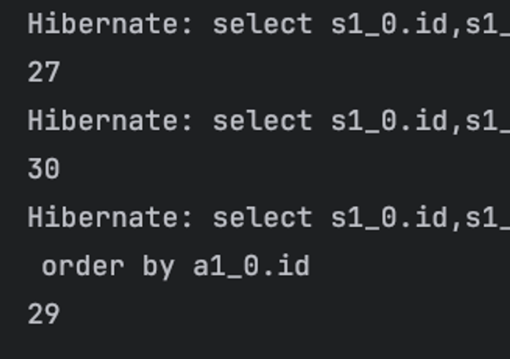
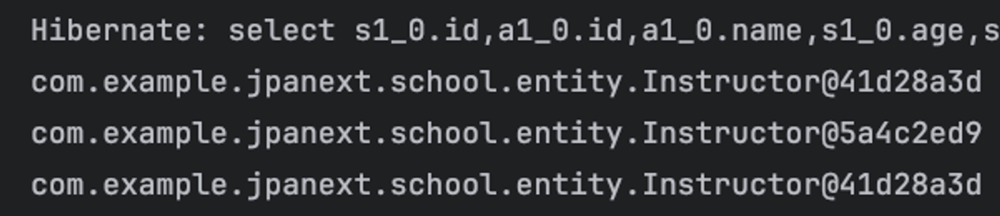
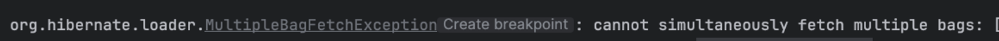

## Join 해서 가져오기
### JPQL Join
- JPQL도 JOIN을 지원
- 객체를 바탕으로 하기 때문에 문법이 조금 다름
```java
// (INNER) JOIN
@Query("SELECT s FROM Student s JOIN s.advisor")
List<Student> findAllJoin();

// LEFT OUTER JOIN
@Query("SELECT s FROM Student s LEFT OUTER JOIN s.advisor")
List<Student> findAllLeftJoin();

// RIGHT (OUTER) JOIN
@Query("SELECT s FROM Student s RIGHT JOIN s.advisor")
List<Student> findAllRightJoin();
```
- `Student`가 가진 `advisor`를 기준으로 JOIN한다고 작성
- `Student`는 `Instructor`와의 연관관계를 나타내는 `Instructor advisor`필드를 가짐
- SQL => `Student s JOIN Instructor i ON s.advisor = i`
- JPQL 에서는 기준이 되는 `Student s`와 `s`가 갖고 잇는 연관관계인 `s.advisor`필드를 명시함으로 JOIN을 하게 됨
----
- `INNER JOIN`의 `INNER`는 생략 가능
- `LEFT OUTER JOIN`과 `RIGHT OUTER JOIN`의 방식, `OUTER`의 생략 여부도 동일하게 작동
- (INNER JOIN) - 양쪽 모두 `null`이 아님
- LEFT OUTER JOIN  - 왼쪽은 누락하지 않고 오른쪽은 없으면 `null`
- RIGHT (OUTER) JOIN - 오른쪽은 누락하지 않고 왼쪽은 없으면 `null`

- JPQL의 JOIN은 두 Entity의 데이터를 전부 가져오지 않고, 실제로 선택한 Entity를 가져오는 용도가 아닌 Proxy가 들어서게 됨
- 이런 Join의 경우 보통 실제로 `Instructor`의 데이터가 필요한 상황이 아닌 `Instructor`의 데이터를 기준으로 조회하는 경우 사용

### JPQL Fetch Join
- 실제 연관관계의 데이터를 가져오고 싶다면, Fetch Join이라는 방식 사용
- N + 1의 문제를 해소하기 위한 대표적인 방법
- 사용한 JOIN 뒤에 `FETCH`를 추가
- JOIN하면서 발생할 수 있는 중복 데이터를 제거하기 위해 `DISTINCT`함께 사용
```java
@Query("SELECT DISTINCT s FROM Student s JOIN FETCH s.advisor")
List<Student> findFetch();

@Query("SELECT DISTINCT s FROM Student s LEFT JOIN FETCH s.advisor")
List<Student> findLeftFetch();

@Query("SELECT DISTINCT s FROM Student s RIGHT JOIN FETCH s.advisor")
List<Student> findRightFetch();
```
- Fetch Join을 하면 한번의 쿼리로 모든 데이터를 불러와 N+1의 문제 발생하지 않음
```java
studentRepository.findFetch().forEach(s ->
        System.out.println(s.getAdvisor()));
```


### `@EntityGraph`
- 연관 관계 어노테이션의 `fetch` 옵션(`FetchType.EAGER`, `FetchType.LAZY`)은 정적 옵션  => 실행 중 조정이 불가능
- JPA의 `EntityGraph`는 설정법이 복잡하지만 Spring Data JPA에서 간단하게 적용할 수 있는 `@EntityGraph` 어노테이션 제공
```java
@EntityGraph(attributePaths = {"advisingStudents"}, type = EntityGraph.EntityGraphType.FETCH)
@Query("SELECT DISTINCT i FROM Instructor i")
List<Instructor> findByEntityGraph();
```
- 목표는 `FetchType`을 실행할 때 결정하는 것
- `attributePaths` : 어떤 속성들을 지정할 것인지 결정
- `type` : 로딩 결정 방식
- `EntityGraphType.FETCH`: 지정된 속성들을 `EAGER`로 설정, 그 외의 속성들은 `LAZY`로 설정
- `EntityGraphType.LOAD`: 지정된 속성들을 `EAGER`로 설정, 그외의 속성들은 기본값 / 설정된 값으로 활용
- 특별한 설정 없이 바로 사용하면 연관관계의 데이터를 불러올 수 있으며, N+1을 피할 수 잇음
- 본래의 `JpaRepository`에 정의된 `findAll()`을 오버드라이드 하여
- `@EntityGraph`를 설정하는 방식으로도 활용 가능
```java
@EntityGraph(attributePaths = {"advisingStudents"}, type = EntityGraphType.LOAD)
List<Instructor> findAll();
```
- 두개 이상의 `Collection`속성을 `attributePaths`에 설정하게 되면 `list`를 사용하는 경우 `MultipleBagFetchException`이 발생
- `Instructor`에 `List<Lecture>`를 추가해서, 두개의 `@OneToMany`를 만든 다음, 둘다 `@EntityGraph`의 `attributePaths`로 추가해보자!
```java
// LECTURE
@Entity
public class Lecture {
    @Id
    @GeneratedValue(strategy = GenerationType.IDENTITY)
    private Long id;

    private String name;
    private String day;
    private Integer startTime;
    private Integer endTime;

    @ManyToOne(fetch = FetchType.LAZY)
    private Instructor instructor;

    @ManyToMany(mappedBy = "attending")
    private final List<Student> students = new ArrayList<>();
}
```
```java
// INSTRUCTOR
@Entity
public class Instructor {
    @Id
    @GeneratedValue(strategy = GenerationType.IDENTITY)
    private Long id;

    private String name;

    @OneToMany(mappedBy = "advisor", fetch = FetchType.LAZY)
    private final List<Student> advisingStudents
            = new ArrayList<>();

    @OneToMany(mappedBy = "instructor", fetch = FetchType.LAZY)
    private final List<Lecture> lectures
            = new ArrayList<>();
}
```
```java
@EntityGraph(attributePaths = {"advisingStudents", "lectures"}, type = EntityGraphType.FETCH)
@Query("SELECT i FROM Instructor i")
List<Instructor> mulitBagFetch();
```

- 이는 하나의 `One` Entity가 두개 이상의 속성에 대해서 `Many`를 가지게 될 경우, 
- 결과적으로 두 연관 관계에 대해서 곱집합을 만들게 되며, `One`에 해당하는 Entity쪽의 `Many` Entity들의 순서를 결정할 수 없어서 발행하는 문제
> ⚠️ `@OneToMany`의 자료형을 `Set`으로 할 경우, 예외는 발생하지 않지만 여전히 곱집합을 생성하여 성능상에 문제가 발생할 수 있습니다.