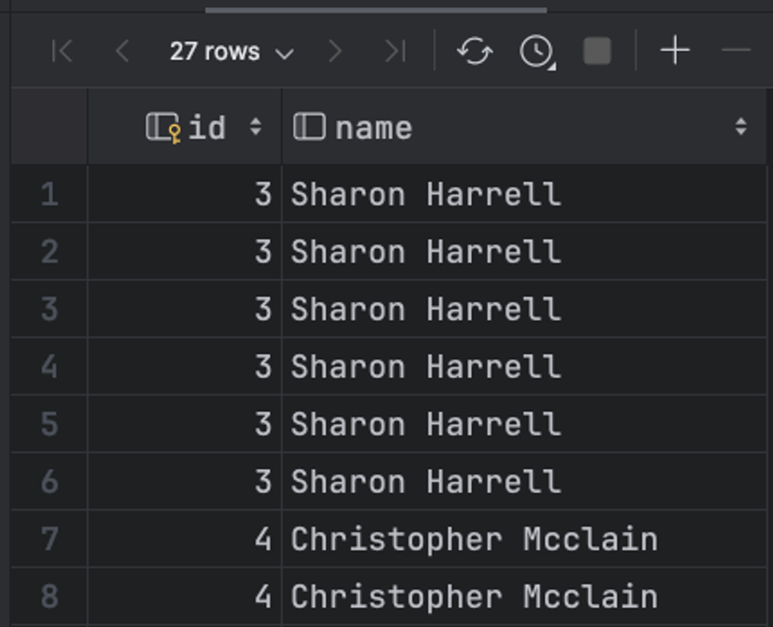
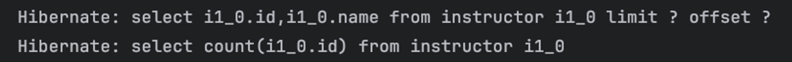
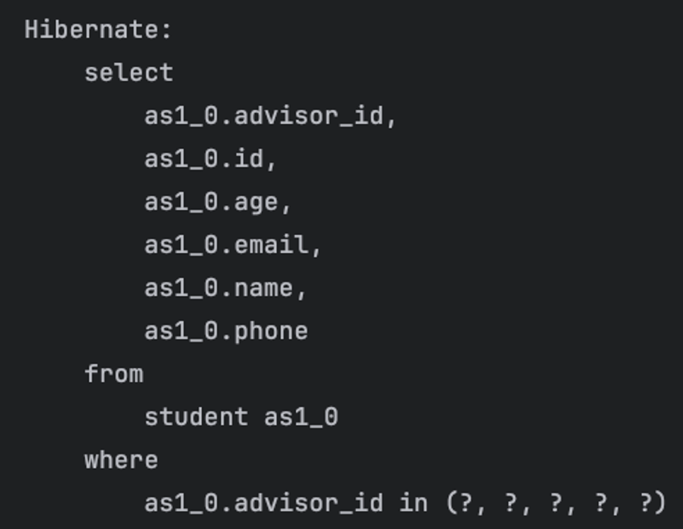

## `@BatchSize`
### Pagination을 적용해보자
- Fetch Join 또는 `@EntityGraph` 둘다 N + 1문제를 해결하는데 정당한 방법이지만 
- `@OneToMany`를 처리하면서 JPA의 페이지 기능을 활용할 때 문제가 발생
- `@OneToMany`를 Fetch Join 하면서 `Pageable`을 매개벼수로 설정하면?
```java
@Query("SELECT DISTINCT i FROM Instructor i LEFT JOIN FETCH i.advisingStudents")
Page<Instructor> findByFetchPage(Pageable pageable);
```
```text
로그> HHH90003004: firstResult/maxResults specified with collection fetch; applying in memory
Hibernate: 
    select
        distinct i1_0.id,
        as1_0.advisor_id,
        as1_0.id,
        as1_0.age,
        as1_0.email,
        as1_0.name,
        as1_0.phone,
        i1_0.name 
    from
        instructor i1_0 
    left join
        student as1_0 
            on i1_0.id=as1_0.advisor_id
Hibernate: 
    select
        count(distinct i1_0.id) 
    from
        instructor i1_0 
    left join
        student as1_0 
            on i1_0.id=as1_0.advisor_id
```
- 수상한 로그와 함께, `limit`나 `offset`이 없는 쿼리가 발생
- 이는 `limit`과 `offset`이 결국 결과 열의 갯수를 바탕으로 동작하는 것인데
- `@OneToMany`관계를 테이블로 표현하면 하나의 엔티티를 기준으로 열이 복수개가 발생하게 되며, 
- 한 페이지의 한 개체에 해당하는 엔티티가 몇개의 열에 걸쳐서 만들어지는지를 사전에 알 수 없기 때문
```sql
select i.id, i.name
from instructor i inner join student s
    on i.id = s.advisor_id
order by i.id;
```

- 실행한 결과, 전체 데이터를 쿼리로 먼저 불러온 다음, 연관 관계를 데이터베이스에서 처리하는게 아닌 JPA에서 처리를 한다는 의미
- 페이징 처리를 한 이유가 사리즌 것과 마찬가지!

### `@BatchSize`
- 이런 `@OneToMany` 관계에서는 연관 관계 데이터를 한번에 가져오면서 페이지도 유연하게 처리하기는 어려움
- 대신, 지연로딩으로 설정된 `@OneToMany`의 경우, 해당하는 `@OneToMany`속성을 요청하는 시점에, 여러 Entity를 대상으로 하는 데이터를 가져오는 것은 가능
- `Instructor`의 `@OneToMany`에 대한 속성에 `@BatchSize`를 주고 `size = 5`로 설정
```java
@BatchSize(size = 5)
@OneToMany(mappedBy = "advisor", fetch = FetchType.LAZY)
private final List<Student> advisingStudents = new ArrayList<>();
```
- 페이징 기능을 위해 보통의 `findAll(Pageable pageable)` 사용
```java
instructorRepository.findAll(PageRequest.of(0, 10))
        .forEach(i -> System.out.println(i.getAdvisingStudents().size()));
```
- 총 4번의 쿼리 발생
1. `LIMIT`,`OFFSE`을 포함한 조회 쿼리
2. 전체 페이지 정보 확인을 위한 `COUNT` 쿼리

- 이후 나오는 첫번째 쿼리는,`Student`를 조회하면서 FK 컬럼인 `advisor_id`가 특정 `id`들 중 하나인 `Student`를 조회하는 쿼리

- 이런 쿼리가 총 2번 발생
- 이 두 쿼리는 `@BatchSize`로 인해 만들어지는 쿼리
- 본래 하나의 `Instructor`의 `@OneToMany`를 조회할 때 한번의 `SELECT`를 호출하는 대신, 
- 한번 호출할 때 `@BatchSize`로 정해진 수량만큼의 `Instructor`를 기준으로 `Student`를 검색하는 쿼리
- 즉, 지연로딩을 유지하면서, 대신 실제 로딩이 필요한 시점에 정해진 수량만킁 한번에 로딩함으로서 N+1 보다는 쿼리를 덜 날리는 바식의 해결법


> 💡 2번의 쿼리 
> 1. `@OneToMany`를 조회할 때 `@BatchSize`만큼 `Student`들을 조회   
> 2. `@BatchSize`를 넘어간 `@OneToMany`를 조회할 때 다음 `Student`들을 조회