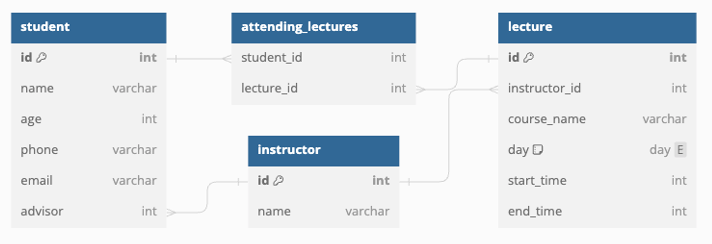

## Relations
### ManyToMany
- M:N, Many To Many
- 테이블의 레코드들이 양방향으로 복수의 연관 관계를 가지는 관계
- 대표적으로 **좋아요**기능
  - 하나의 게시글은 여러 사용자에게 **좋아요**를 받을 수 있음
  - 한명의 사용자는 여러 게시글을 **좋아요**할 수 있음
- 또는 학생과 강의의 관계
  - 한 학생은 여러 강의를 수강
  - 한 강의에는 여러 학생들이 참석


> 💡 이러한 관계를 표현하기 위해서는 양쪽 테이블의 PK를 외래키로 갖는 제 3의 테이블이 필요,    
> 기본적으로 양쪽다 1:N 에서 1의 역할을 하기 때문에 다수의 역할을 하는 테이블을 별도로 생성



---
### `@ManytoMany`
- `Student` Entity
```java
@Entity
public class Student {
    @Id
    @GeneratedValue(strategy = GenerationType.IDENTITY)
    private Long id;

    private String firstName;
    private String lastName;
}
```
- `Lecture` Entity
```java
@Entity
public class Lecture {
    @Id
    @GeneratedValue(strategy = GenerationType.IDENTITY)
    private Long id;

    private String name;
    private String day;
    private Integer startTime;
    private Integer endTime;
}
```
- 두 Entity를 M:N 연관 관계로 설정하기 위해서 `@ManyToMany` 어노테이션 활용
```java
@Entity
public class Student {
    @Id
    @GeneratedValue(strategy = GenerationType.IDENTITY)
    private Long id;

    private String firstName;
    private String lastName;

    @ManyToMany
    @JoinTable(name = "attending_lectures")
    private final List<Lecture> attending = new ArrayList<>();
}
```
- `JoinTable` : `JoinColumn`과 비슷한 역할, `@ManyToMany` 관계를 표현하기 위해 필요한 Join Table의 형태를 조정하기 위한 용도(테이블 이름 설정)
- 반대쪽에서 `@ManyToMany` 관계의 레코드를 찾고 싶다면 해당 속성의 `@ManyToMany`를 작성
- 특별한 설정을 하지 않는다면 해당 두 `@ManyToMany`가 같은 관계를 나타내는 어노테이션인지 인지할 수 없고 불필요한 테이블이 생성
- `maapedBy` 속성 사용
```java
@Entity
public class Lecture {
    @Id
    @GeneratedValue(strategy = GenerationType.IDENTITY)
    private Long id;

    private String name;
    private String day;
    private Integer startTime;
    private Integer endTime;

    @ManyToMany(mappedBy = "attending")
    private final List<Student> students = new ArrayList<>();
}
```
- `mappedBy = "attending"` : `Student`의 attending이라는 객체외 매핑되었다는 의미
- Join Table의 레코드를 추가하고 싶다면 필드의 컬렉션 자료형에 연관관계를 맺고자 하는 엔티티를 추가한 뒤, `repository`를 이용해 저장
```java
Optional<Student> optionalStudent 
        = studentRepository.findById(id);
if (optionalStudent.isEmpty())
    throw new ResponseStatusException(HttpStatus.NOT_FOUND);
Optional<Lecture> optionalLecture 
        = lectureRepository.findById(lectureId);
if (optionalLecture.isEmpty())
    throw new ResponseStatusException(HttpStatus.NOT_FOUND);

Student student = optionalStudent.get();
Lecture lecture = optionalLecture.get();

student.getAttending().add(lecture);
studentRepository.save(student);
```
- `optionalStudent`와 `optionalLecture`가 모두 비어 있지 않다면, 각각의 Optional 객체에서 각각의 엔티티를 가져옴(get() 메서드를 사용)
- 학생이 해당 강의를 참석하도록 설정
  - `getAttending()` : 학생이 참석하는 강의들을 나타내는 컬렉션(Entity에서 다대다 매핑)
- `Optional`을 사용하는 이유는 데이터베이스에서 엔티티를 가져오는 작업이 실패할 가능성 때문