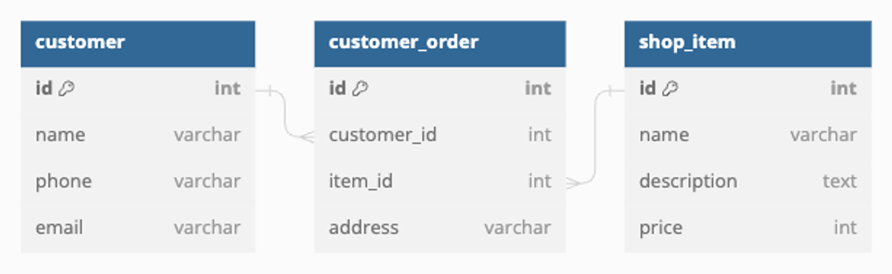

## Relations 
### Join Table에 속성 추가
- 실무에서 `@ManyToMany` 하나만으로는 M:N 관계를 생성하기 힘든 경우도 존재
  - ex) 주문정보



- 주문 정보는 고객과 상품의 M:N 관계
- 주문 정보는 물품 배송지, 구매 갯수, 총 지불 금액 등 다양한 정보 포함
- 이런 테이블을 표현할 때, `@JoinTable`, `@JoinColumn`을 이용
```java
@Entity
public class Customer {
    @Id
    @GeneratedValue(strategy = GenerationType.IDENTITY)
    private Long id;

    private String name;
    private String phone;
    private String email;

    @ManyToMany(mappedBy = "customers")
    private final List<Item> items = new ArrayList<>();
}
```
```java
@Entity
public class Item {
    @Id
    @GeneratedValue(strategy = GenerationType.IDENTITY)
    private Long id;

    private String name;
    private String description;
    private Integer price;

    @ManyToMany
    private final List<Customer> customers = new ArrayList<>();
}
```
- `@JoinTable`을 이용해 Join Table의 모습을 정의
```java
@Entity
public class Item {
    @Id
    @GeneratedValue(strategy = GenerationType.IDENTITY)
    private Long id;

    private String name;
    private String description;
    private Integer price;

    @ManyToMany
    @JoinTable(
            name = "customer_order",
            joinColumns = @JoinColumn(name = "item_id"),
            inverseJoinColumns = @JoinColumn(name = "customer_id")
    )
    private final List<Customer> customers = new ArrayList<>();
}
```
- `joinColumns`와 `inverseJoinColumns`를 통해 만들어질 Join Table이 가져야 할 컬럼의 이름 정의
- `joinColumns` : 현재 Entity의 id를 FK로 갖는 컬럼의 이름을 지정/ Item의 왜래키에 대한 정보
- `inverseJoinColumns` : 대상 Entity의 id를 FK로 갖는 컬럼의 이름을 지정

> 즉,  `joinColumns`에서는 Item 엔티티의 주 키(일반적으로 id)를 참조하여 현재 엔티티를 식별하고,    
> `inverseJoinColumns`에서는 Customer 엔티티의 주 키(일반적으로 id)를 참조하여 대상 엔티티를 식별   
> 💡 만약 이 설정을 Customer에서 할 경우 `joinColums`에는 Customer 가 들어가고, `inverseJoinColumns`에넌 Item이 들어감

---
- `@JoinTable`을 이용하여 다대다 관계를 매핑할 때는 중간 테이블이 필요
- `Customer`와 `Item`간의 다대다 관계를 나타내는 테이블의 이름을 위에서 `customer_order`라고 정의했기 때문에 이에 대한 엔티티 클래스가 필요
- `@JoinTable`의 정의와 동일한 Entity 생성
```java
@Entity
@Table(name = "customer_order")
public class Order {
    @Id
    @GeneratedValue(strategy = GenerationType.IDENTITY)
    private Long id;

    @ManyToOne
    @JoinColumn(name = "item_id")
    private Item item;

    @ManyToOne
    @JoinColumn(name = "customer_id")
    private Customer customer;

    private String address;
}
```
- `@JoinTable` 어노테이션에서 정의와 일치하도록
  - `@Table`로 이름을 설정
  - `@ManyToOne`에는 `@JoinColumn` 추가
- `order`는 `Item`과 `Customer`와 각각 N:1 관계
- 개별 Entity를 바탕으로 `JoinTable`의 Entity를 가져올 수 있음
- 테스트 코드
```java
// 고객 생성
Customer customer = Customer.builder()
        .name("alex")
        .build();
customer = customerRepository.save(customer);

// 상품 생성
Item item = Item.builder()
        .name("mouse")
        .build();
item = itemRepository.save(item);

item.getCustomers().add(customer);
item = itemRepository.save(item);

Optional<Order> optionalOrder = orderRepository.findByItemAndCustomer(item, customer);
```
- Item과 Customer의 관계를 설정하면 Order도 같이 생성
```java
Item item = itemRepository.findFirstByName("mouse").get();
log.info(String.valueOf(item.getCustomers().size()));
```