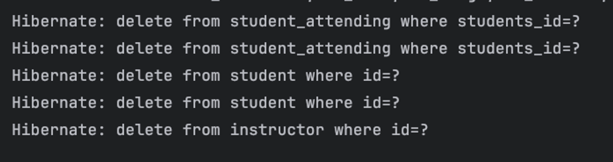

## Relations 💡
### 영속성 전이 - Cascade
영속성 전이(Persistence Cascade) 
- 부모 엔티티의 상태 변화가 자식 엔티티에 영향을 주는 것 
- ex) 부모 엔티티를 저장할 때 자동으로 관련된 자식 엔티티도 저장되는 것

---
- 일반적인 상황에서 `@OneToMany` 관계를 사용할 때, 주로 `@ManyToOne`과 함께 양방향 관계로 활용
- `mappedBy`를 이용해 `@OneToMany`와 연결되어 있는 `@ManyToOne` 속성을 지정
- 이는 관계의 주가 되는 속성이 누군지 지정하는 것
```java
@Entity
public class Student {
    @Id
    @GeneratedValue(strategy = GenerationType.IDENTITY)
    private Long id;

    private String name;
    private Integer age;
    private String phone;
    private String email;

    @ManyToOne
    private Instructor advisor;

    @ManyToMany
    @JoinTable(name = "attending_lectures")
    private final List<Lecture> attending = new ArrayList<>();
}
```
```java
@Entity
public class Instructor {
    @Id
    @GeneratedValue(strategy = GenerationType.IDENTITY)
    private Long id;
    private String name;

    @OneToMany(mappedBy = "advisor")
    private List<Student> advisingStudents;
}
```
---
```java
Instructor instructor = Instructor.builder()
        .name("Linus Torvalds")
        .build();

Student alex = Student.builder()
        .name("alex")
        .advisor(instructor)
        .build();
Student brad = Student.builder()
        .name("brad")
        .advisor(instructor)
        .build();

instructor.getAdvisingStudents().add(alex);
instructor.getAdvisingStudents().add(brad);
instructorRepository.save(instructor);
```
- `Instructor`객체의 `advisingStudents`에 여러 `Student` 객체를 넣고 `instructorRepository.save()`를 호출하더라도
- 실제로 해당하는 `Student` 객체들이 저장되지 않음, `instructor`만 저장
- `@OneToMany`와 `@ManyToOne` Entity 둘의 관계에서 데이터의 주도권을 갖고 있는 Entity는 **`@ManyToOne`으로 표햔되는 FK**를 갖는 `Student`
- 💡 그러므로 데이터를 저장하기 위해서는 만들어진 `Instructor`객체를 `Student`에 전달하는 방식으로 생성 
```java
Instructor instructor = Instructor.builder()
          .name("Linus Torvalds")
          .build();
  instructor = instructorRepository.save(instructor);
  List<Student> students = new ArrayList<>();
  students.add(Student.builder()
          .name("alex")
          .advisor(instructor)
          .build());
  students.add(Student.builder()
          .name("brad")
          .advisor(instructor)
          .build());
  studentRepository.saveAll(students);
```
- `@OneToMany` 필드의 영속성 전이(`cascade`) 옵션을 조정하어 `Instructor`의 변경 사항이 저장될 때, 그에 따른 영속성 변화를 `Student`에 전달
---
### `CascadeType` 옵션
- `ALL` : 아래 모든 설정 사용 
- `PERSIST` : 저장될 때 연관된 Entity를 같이 저장
- `REMOVE` : 제거될 때 연관된 Entity를 같이 제거
- `MERGE`,`REFRESH`,`DETACH`...

### `CascadeType.PERSIST`
- `PERSIST` : 저장될 때 연관된 Entity를 같이 저장
```java
@Entity
public class Instructor {
    @Id
    @GeneratedValue(strategy = GenerationType.IDENTITY)
    private Long id;
    private String name;

    @OneToMany(mappedBy = "advisor", cascade = CascadeType.PERSIST)
    private final List<Student> advisingStudents = new ArrayList<>();
}
```
- `PERSIST`는 지속하다는 뜻
- `instructor`의 `advisingStudent`에 데이터를 추가하고 저장할 때, 저장되지 않은 `Student` Entity를 전부 저장하는 옵션
- 실행 순서
  - 1. `INSERT INTO instructor` 실행
  - 2. `Student`를 위한 `INSERT INTO student` 실행


### `CascadeType.REMOVE`
- `REMOVE` : 제거될 때 연관된 Entity를 같이 제거
```java
@Entity
public class Instructor {
    @Id
    @GeneratedValue(strategy = GenerationType.IDENTITY)
    private Long id;
    private String name;

    @OneToMany(mappedBy = "advisor", cascade = CascadeType.REMOVE)
    private final List<Student> advisingStudents = new ArrayList<>();
}
```
- `REMOVE`는 제거한다는 뜻
- `PERSIST`와 반대로 동작
- 저장할 때 변경사항을 같이 반영하는 게 `PERSIST` / `REMOVE`는 데이터를 삭제할 때 연관 데이터를 삭제
  - ex) `Student` 둘 생성, `Instructor` 할당 , 저장 후 다시 `Instructor` 삭제
```java
Instructor instructor = Instructor.builder()
        .name("Linus Torvalds")
        .build();
instructor = instructorRepository.save(instructor);
List<Student> students = new ArrayList<>();
students.add(Student.builder()
        .name("alex")
        .advisor(instructor)
        .build());
students.add(Student.builder()
        .name("brad")
        .advisor(instructor)
        .build());
studentRepository.saveAll(students);

// ...

instructorRepository.deleteById(id);
```

1. `Student` 데이터 삭제 되기 전 `@ManyToMany` 의 Join Table(student_attending) 데이터 삭제
2. `Instructor`가 데이터 삭제 되기 전, `Student` 데이터 삭제
3. `Instructor` 데이터 삭제