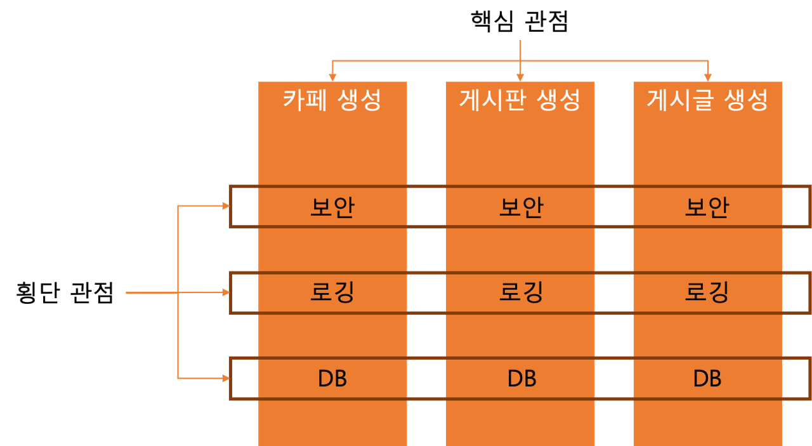

## JWT
### HandlerInterceptor & Filter
> 💡`횡단 관심/관점` : 서로 다른 비즈니스 로직이 공통적으로 가졌으면 하는 기능    


- Spring에서 요청과 응답 전후로 코드를 실행할 수 있는 방법 2가지
  - `HandlerInterceptor`
  - `Filter`
----
`HandlerInterceptor`: Spring Framework의 일부분
- `DispatcherServlet`이 HandlerMethod로 요청을 넘기기 전에 실행
- 비즈니스 로직과 연관성이 높은 기능 구현      


`Filter`: Jakarta Servlet API의 일부분
- `DispatcherServlet`에 도달하기 전에 요청을 검사할 수 있음
- Spring 외부의 기능이므로, 예외처리 등에서 Spring Framework의 도움을 받지 못함
- 비즈니스 로직과 무관한 기능 구현에 사용   


---
### `HnadlerInterceptor`
인터셉터를 만들고 싶은 경우 `HandlerInterceptor` 인터페이스를 **상속**받는 구현체 생성
- `preHandle`: HandlerMethod가 실행되기 전에 실행
- `postHandle`: HandlerMethod가 실행 후, 응답이 전달되기 전, View의 내부를 채워 넣기 전 실행
- `afterCompletion`: 요청의 처리가 마무리 된 뒤, 예외 발생 시 예외 정보가 인자로 추가됨

```java
@Component
public class HeaderLoggingInterceptor implements HandlerInterceptor {
    @Override
    public boolean preHandle(
            HttpServletRequest request,
            HttpServletResponse response,
            Object handler
    ) throws IOException {
        return true;
    }

    @Override
    public void postHandle(
            HttpServletRequest request,
            HttpServletResponse response,
            Object handler,
            ModelAndView modelAndView
    ) {}

    @Override
    public void afterCompletion(
            HttpServletRequest request,
            HttpServletResponse response,
            Object handler, Exception ex
    ) {}
}
```
- `preHandle` 메서드에서 반환하는 `true` 또는 `false`에 따라 요청 처리 결정
  - 즉,`postHandle`/`afterCompletion`은 실행 되지 않을 수 있음
  - 요청 처리 중 예외가 발생할 경우 `postHandle`실행 x
- `HandlerInterceptor` 생성 후 `Configuration`을 이용해 실행 설정 가능
  - `WebMvcConfigurer` 상속 후 `addInterceptors` 메서드를 오버라이딩해서 interceptor를 등록


```java
@Configuration
@RequiredArgsConstructor
public class InterceptorConfig implements WebMvcConfigurer {
    private final LoggingInterceptor loggingInterceptor;
    @Override
    // 인터셉터를 등록하기 위한 메서드
    public void addInterceptors(InterceptorRegistry registry) {
        registry
                // 어떤 인터셉터를
                .addInterceptor(loggingInterceptor)
                // 어떤 경로에
                .addPathPatterns("/tests");
    }
}
```
- `HandlerInterceptor` 작동 원리 상, `DispatcherServlet`이 `HandlerMethod`에 요청을 이관하기 전 실행
  - 실제 요청 및 응답 데이터(body)를 활용하기 어려움

---
### `Filter`
필터를 만들고 싶은 경우 `Filter`인터페이스 구현
- Spring Boot의 경우 `Filter`인터페이스 구현 , Bean 객체로 등록 => `Filter` 자동으로 사용
- `Filter`는 `doFilter()` 메서드 하나만 구현

```java
@Slf4j
@Component
public class LogFilter implements Filter {
    @Override
    public void doFilter(
            ServletRequest request,
            ServletResponse response,
            FilterChain chain
    ) throws IOException, ServletException {
        HttpServletRequest httpServletRequest = (HttpServletRequest) request;
        log.info("start request: {} {}",
                httpServletRequest.getMethod(),
                httpServletRequest.getRequestURI()
        );

        ContentCachingRequestWrapper requestWrapper
                = new ContentCachingRequestWrapper(httpServletRequest);

        // doFilter를 호출하지 않을 경우 다음 필터가 실현되지 않으며
        // -> 요청이 끝까지 전달되지 않는다.
        // --- 이 위는 요청 처리 전
        chain.doFilter(requestWrapper, response);
        // --- 이 아래는 요청 처리 후

        // doFilter전에 호출하면 오류가 나지는 않지만 로그가 찍히지도 않는다.
        log.info(new String(
                requestWrapper.getContentAsByteArray(), StandardCharsets.UTF_8));

        HttpServletResponse httpServletResponse = (HttpServletResponse) response;
        log.info("send response: {}", httpServletResponse.getStatus());
    }
}

```
- `Filter`의 경우 Servlet API를 바로 활용
  - `ServletRequest`/`ServletResponse` 직접 커스텀 해서 사용 가능
  - `Interceptor` 보다 활용도 자체는 높음
  - But, Spring 에서 제공하는 다양한 편의 기능 활용 어려움