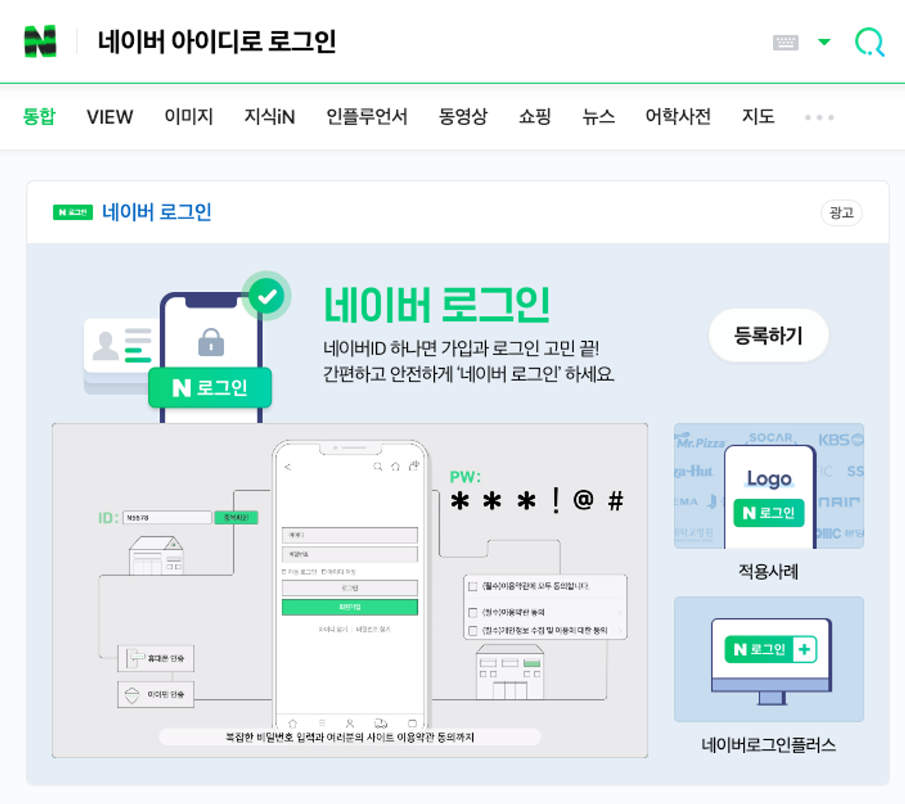
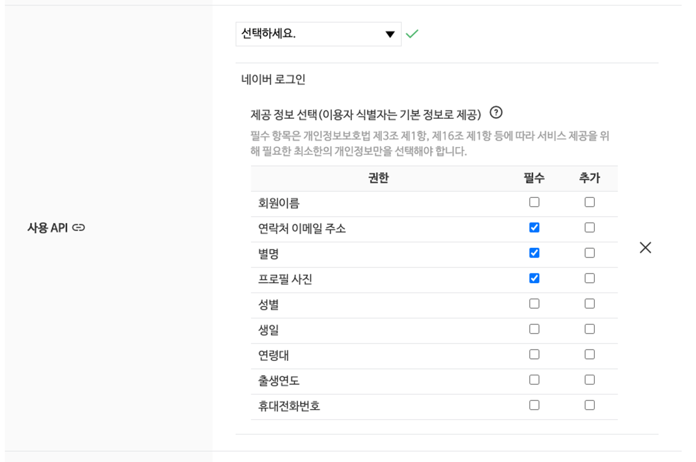
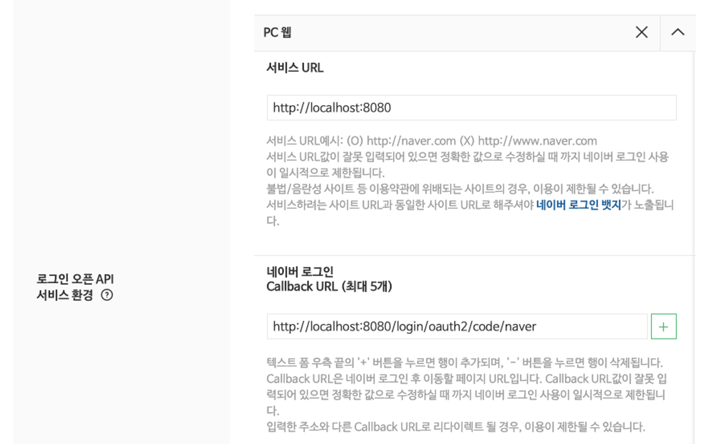

## 네이버 아이디로 로그인 구성
- 네이버에 등록된 사용자 정보를 조회하는 API
- 사용을 위해서 만드는 서비스를 등록해야 함

---
- `네이버 아이디로 로그인` 검색
  
- 등록하기 버튼으로 이동 : https://developers.naver.com/apps/#/register


- 서비스 이름 입력, 사용 api를 `네이버 로그인` 선택


사용 api 선택

- 사용자가 네이버 아이디로 로그인 하는 과정에서 정보제공 동의 할 떄 확인 가능   


- 로그인 환경: pc웹
- 서비스 URL: `http://localhost:8080`
- Callback URL: `http://localhost:8080/login/oauth2/code/naver`   
=> 사용자가 인증을 완료한 뒤 정보가 전달될 URL 설정하는 것, Spring Boot에서도 동일한 URL로 설정 진행


등록하기 -> 구성 완료!

- Client ID, Client Secret -> 사용자 정보 요청하기 위해 필요한 인증 정보
----
### Spring Boot OAuth2 Client
#### `applicaton.yaml` 구성
- OAuth 설정 2가지
  - 서비스 제공자의 엔드포인트에 대한 정보
  - 해당 엔드포인트로 요청을 보내기 위한 정보 작성

1. 서비스 제공자의 엔트포인트에 대한 정보
```yaml
spring:
  security:
    oauth2:
      client:
        provider:
          naver:
            authorization-uri: https://nid.naver.com/oauth2.0/authorize
            token-uri: https://nid.naver.com/oauth2.0/token
            user-info-uri: https://openapi.naver.com/v1/nid/me
            user-name-attribute: response
```
`spring.security.oauth2.client.provider`: 설정은 OAuth서비스 제공자에 대한 정보를 작성하는 부분    
`spring.security.oauth2.client.provider.{제공자}` 와 같은 형태로 특정 서비스 제공자의 정보 작성
- `authorization-uri`: 사용자를 redirect 하기 위한 URL 작성
- `token-url`: 사용자 정보 요청을 위한 Access Token을 받기 위한 URL 작성
- `user-info-uri`: 사용자 정보를 조회하기 위한 URL 작성
- `user-name-attribute`: 서비스 제공자로부터 받은 사용자 정보 중 어떤 부분을 활용하는지 작성
  - 데이터 처리 과정에서 동적으로 데이터를 선별하기 위해 사용되는 편


- 위의 url 확인할 수 있는 곳
  - https://developers.naver.com/docs/login/api/api.md
  - https://developers.naver.com/docs/login/profile/profile.md


- Provider를 사용하기 위한 설정
```yaml
spring:
  security:
    oauth2:
      client:
        # ...
        registration:
          naver:
            client-id: <Client Id>
            client-secret: <Client Secret>
            redirect-uri: http://localhost:8080/login/oauth2/code/naver
            authorization-grant-type: authorization_code
            client-authentication-method: client_secret_post
            client-name: Naver
            scope:
              - nickname
              - email
              - profile_image
```
- `provider`와 유사   
- `spring.security.oauth2.client.registration.{제공자}` 형태로 진행
  - `{진행자}` 부분에 들어가는 내용: `spring.security.oauth2.client.provider.{제공자}`에서 설정한 내용 중 사용하고 싶은 제공자와 동일하게 설정


- `client-Id`, `client-secret`: 애플리케이션 정보 창에서 확인
- `redirect-uri`: 앞에서 설정한 Callback URL 작성
- `authorization-grant-type`: 어떤 방식으로 Access Token을 받을지 설정
- `client-authetication-method`: Client Id와 Client Secret를 요청의 어디에 포함할지 정의
  - `client-secret-post`는 POST요청의 Body에 데이터를 포함해 전달
----
#### `OAuth2UserServiceImpl`
사용자가 정상적인 인증 이후 사용자 데이터를 조회하고 처리하기 위한 `OAuth2userService`
```java
@Slf4j
@Service
public class OAuth2UserServiceImpl extends DefaultOAuth2UserService {
    @Override
    public OAuth2User loadUser(OAuth2UserRequest userRequest)
            throws OAuth2AuthenticationException {
        OAuth2User oAuth2User = super.loadUser(userRequest);
        // ...
    }
}
```
- 미리 구성된 `DefaultOAuth2UserService` 상속받아 구현
  - `DefaultOAuth2UserService`는 Spring Boot 내부적으로 설정이 정의된 서비스 제공자에 대해 큰 설정 없이 사용할 수 있는 `OAuth2UserService`
- 전달 받은 데이터 중 원하는 데이터를 활용하도록 구현하기 위해 `super.loadUser()`호출한 뒤 결과 활용
```java
@Override
public OAuth2User loadUser(OAuth2UserRequest userRequest) 
        throws OAuth2AuthenticationException {
    OAuth2User oAuth2User = super.loadUser(userRequest);
    // 어떤 서비스 제공자를 사용했는지
    String registrationId = userRequest
            .getClientRegistration()
            .getRegistrationId();
    // OAuth2 제공자로 부터 받은 데이터를 원하는 방식으로 다시 정리하기 위한 Map
    Map<String, Object> attributes = new HashMap<>();
    attributes.put("provider", "naver");

    // Naver 아이디로 로그인
    if (registrationId.equals("naver")) {
      // Naver에서 받아온 정보다.
      attributes.put("provider", "naver");

      Map<String, Object> responseMap
            // 네이버가 반환한 JSON에서 response를 회수
            = oAuth2User.getAttribute("response");
      attributes.put("id", responseMap.get("id"));
      attributes.put("email", responseMap.get("email"));
      attributes.put("nickname", responseMap.get("nickname"));
      attributes.put("name", responseMap.get("name"));
      attributes.put("profileImg", responseMap.get("profile_image"));
      nameAttribute = "email";
    }

    return new DefaultOAuth2User(
            Collections.singleton(new SimpleGrantedAuthority("ROLE_USER")),
            attributes,
            nameAttribute
    );
}
```
- 사용할 데이터 정리 후 User객체 반환
- WebSecurityConfig에도 Service 추가
```java
// WebSecurityConfig.java
public class WebSecurityConfig {
    private final JwtTokenUtils jwtTokenUtils;
    private final UserDetailsManager manager;
    private final OAuth2UserServiceImpl oAuth2UserService;

    // ...
          .oauth2Login(oauth2Login -> oauth2Login
                .loginPage("/users/login")
                .userInfoEndpoint(userInfo -> userInfo
                .userService(oAuth2UserService))
                )
  // ...
}
```
----
#### `OAuth2SuccessHandler`
- 성공적인 OAuth2 인증을 진행한 뒤 어떻게 동작할지 구현
- 지금은 JWT 토큰 방식으로 인증하고 있기 때문에 `JwtTokenUtils`를 활용해 JWT 생성
- JWT를 필요로 하는 클라이언트에 전달을 가정, JWT 정보 그대로 반환하는 엔드포인트로 Redirect 작성
- Redirect 과정 간소화를 위해 `SimpleUrlAuthenticationSuccessHandler` 사용
```java
@Slf4j
@Component
public class OAuth2SuccessHandler
        // 인증에 성공했을 때 특정 URL로 리다이렉트 하고 싶은 경우 활용 가능한 SuccessHandler
        extends SimpleUrlAuthenticationSuccessHandler {
    // JWT 발급을 위해 JwtTokenUtils
    private final JwtTokenUtils tokenUtils;

    public OAuth2SuccessHandler(JwtTokenUtils tokenUtils) {
        this.tokenUtils = tokenUtils;
    }

    @Override
    public void onAuthenticationSuccess(
            HttpServletRequest request,
            HttpServletResponse response,
            Authentication authentication
    ) throws IOException, ServletException {
      // OAuth2UserServiceImpl 의 반환값이 할당된다.
      OAuth2User oAuth2User
              = (OAuth2User) authentication.getPrincipal();

      // 넘겨받은 정보를 바탕으로 사용자 정보를 준지
      String email = oAuth2User.getAttribute("email");
      String provider = oAuth2User.getAttribute("provider");
      String username
              = String.format("{%s}%s", provider, email);
      String providerId = oAuth2User.getAttribute("id");
      // 처음으로 이 소셜 로그인으로 로그인을 시도했다.
      if (!userDetailsManager.userExists(username)){
        // 새 계정을 만들어야 한다.
        userDetailsManager.createUser(CustomUserDetails.builder()
                .username(username)
                .email(email)
                .password(providerId)
                .build());
      }

      // 데이터베이스에서 사용자 계정 회수
      UserDetails details
              = userDetailsManager.loadUserByUsername(username);
      // JWT 생성
      String jwt = tokenUtils.generateToken(details);
      // 어디로 리다이렉트 할지 지정
      String targetUrl = String.format(
              "http://localhost:8080/token/validate?token=%s", jwt
      );
      getRedirectStrategy().sendRedirect(request, response, targetUrl);
    }
}
```
- `/token/validate` 엔드포인트를 `TokenController`에 추가
```java
//TokenController.java
 @GetMapping("/validate")
    public Claims validateToken(
        @RequestParam("token")
        String token
    ) {
        if (!jwtTokenUtils.validate(token))
            throw new ResponseStatusException(HttpStatus.UNAUTHORIZED);

        return jwtTokenUtils.parseClaims(token);
    }

```

----
#### `WebSecurityConfig`
- `OAuth2UserServiceImpl` 과 `OAuth2SuccessHandler` 를 구성
  - 먼저 두 Bean 객체를 가져옴 -> `@RequiredArgsConstructor`
```java
// @Bean을 비록해서 여러 설정을 하기 위한 Bean 객체
@Configuration
@RequiredArgsConstructor
public class WebSecurityConfig {
    private final JwtTokenUtils jwtTokenUtils;
    private final UserDetailsManager manager;
    private final OAuth2UserServiceImpl oAuth2UserService;
    private final OAuth2SuccessHandler oAuth2SuccessHandler;

    // ...
                .oauth2Login(oauth2Login -> oauth2Login
                        .loginPage("/users/login")
                        .successHandler(oAuth2SuccessHandler)
                        .userInfoEndpoint(userInfo -> userInfo
                                 .userService(oAuth2UserService))
    // ...
```
- `.loginPage()`: 이전의 `formLogin`과 마찬가지로 비인증 사용자를 이동시킬 페이지
- `oauth2Login`을 구성하게 되면 기본적으로 로그인 페이지가 자동으로 구성
  - 1. 자신이 로그인 페이지를 생성 ✔
  - 2. 항상 401 응답을 돌려주는 엔드포인트 구성   
- `userInfoEndpoint()`: 사용자 정보를 조회하는 Endpoint 설정, 지금은 사용자 정보 조회 후 동작을 정의하기 위해 `userService`를 등록
- `successHandler()`: 인증 성공 시 사용한 Handler 객체 설정