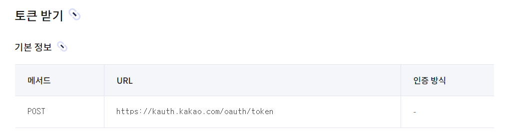

## 카카오 아이디로 로그인 구성
- 카카오에 등록된 사용자 정보를 조회하는 API
- 사용을 위해서 만드는 서비스를 등록해야 함

---
### 사이트 설정
- `카카오 아이디로 로그인` 검색
- 카카오 계정 로그인
- 내 애플리케이션 등록: https://developers.kakao.com/console/app

- 앱 아이콘을 반드시 등록해야 함
- 개인 개발자로 진행할 예정이기 때문에 사업자명은 내 이름으로 진행
- 카카오 로그인 탭: 활성화 ON
- 동의 항목 텝: 원하는 항목 추가(닉네임, 프로필 사진, 이메일 등) 필수 항목이나 선택 항목 중 설정 가능
- 보안 탭: Client Secret 발급, 활성화 사용으로 설정

----
### 인텔리제이 설정
- `application.yaml`
```yaml
spring:
  security:
    oauth2:
      client:
        # OAuth2 서비스 제공자를 사용하는 방법
        provider:
          naver:
            # 인증 요청 URL
            authorization-uri: https://nid.naver.com/oauth2.0/authorize
            # Access Token 요청 URL
            token-uri: https://nid.naver.com/oauth2.0/token
            # 사용자 정보 조회 URL
            user-info-uri: https://openapi.naver.com/v1/nid/me
            # 응답받은 사용자 정보 중 사용자 이름이 무엇인지 담겨있는 JSON key
            user-name-attribute: response
          kakao:
            authorization-uri: https://kauth.kakao.com/oauth/authorize
            token-uri: https://kauth.kakao.com/oauth/token
            user-info-uri: https://kapi.kakao.com/v2/user/me
            user-name-attribute: id

        registration:
          kakao:
            client-id: {REST API 키 값}
            client-secret: {보안 - Client Secret 코드}
            redirect-uri: http://localhost:8080/login/oauth2/code/kakao
            authorization-grant-type: authorization_code
            client-authentication-method: client_secret_post
            client-name: Kakao
            scope:
              - profile_nickname
              - profile_image
              - account_email
          #... 나머지 naver 설정
```
#### provider
- `authorization-uri : https://nid.naver.com/oauth2.0/authorize`
  - https://developers.kakao.com/docs/latest/ko/kakaologin/rest-api#request-code
  - 위의 링크에서 카카오 로그인 - REST API의 인가코드 받기
  


- `token-uri: https://kauth.kakao.com/oauth/token`
  - https://developers.kakao.com/docs/latest/ko/kakaologin/rest-api#request-token
  - 위의 링크에서 카카오 로그인 - REST API의 토큰 받기
  


- `user-info-uri: https://kapi.kakao.com/v2/user/me`
  - https://developers.kakao.com/docs/latest/ko/kakaologin/rest-api#req-user-info
  - 위의 링크에서 카카오 로그인 - REST API 사용자 정보 가져오기
  


- `user-name-attribute`: id 로 설정

#### registration
- `client-id: {REST API 키 값}` 
  - 내 애플리케이션 - 앱키 - REST API 키 값 입력


- `client-secret: {보안 - Client Secret 코드}` 
  - 내 애플리케이션 - 보안 - Client Secret 코드 값 입력


- `redirect-uri: http://localhost:8080/login/oauth2/code/kakao`
-----
### OAuth2SuccessHandler.java
```java
  @Override
    public void onAuthenticationSuccess(
            HttpServletRequest request,
            HttpServletResponse response,
            Authentication authentication
    ) throws IOException, ServletException {
        // OAuth2UserServiceImpl 의 반환값이 할당된다.
        OAuth2User oAuth2User
                = (OAuth2User) authentication.getPrincipal();
        // 넘겨받은 정보를 바탕으로 사용자 정보를 준지
        String email = oAuth2User.getAttribute("email");
        String provider = oAuth2User.getAttribute("provider");
        String username
                = String.format("{%s}%s", provider, email);
// !!! 추가한 부분
        String providerId = oAuth2User.getAttribute("id").toString();
//         
        // 처음으로 이 소셜 로그인으로 로그인을 시도했다.
        if (!userDetailsManager.userExists(username)){
            // 새 계정을 만들어야 한다.
            userDetailsManager.createUser(CustomUserDetails.builder()
                    .username(username)
                    .email(email)
                    .password(providerId)
                    .authorities("ROLE_USER")
                    .build());
        }
```
### OAuth2UserServiceImpl.java
```java
 // Kakao 아이디로 로그인
        if (registrationId.equals("kakao")) {
            log.info(oAuth2User.getAttributes().toString());
            // Kakao에서 받아온 정보다
            attributes.put("provider","kakao");
            attributes.put("id",oAuth2User.getAttribute("id"));
            Map<String, Object> kakaoAccount
                    = oAuth2User.getAttribute("kakao_account");
            attributes.put("email", kakaoAccount.get("email"));
            Map<String, Object> kakaoProfile
                    = (Map<String, Object>) kakaoAccount.get("profile");
            attributes.put("nickname",kakaoProfile.get("nickname"));
            attributes.put("profile_image_url", kakaoProfile.get("profile_image_url"));
            nameAttribute = "email";
        }

```
### login-form.html
```html
<!-- // ... -->
     <div style="margin-top: 16px; text-align: right">
                <a href="/oauth2/authorization/naver">네이버</a>
                <a href="/oauth2/authorization/kakao">카카오</a>
                <a href="/users/register">회원가입</a>
    </div>
<!-- // ... -->
```
