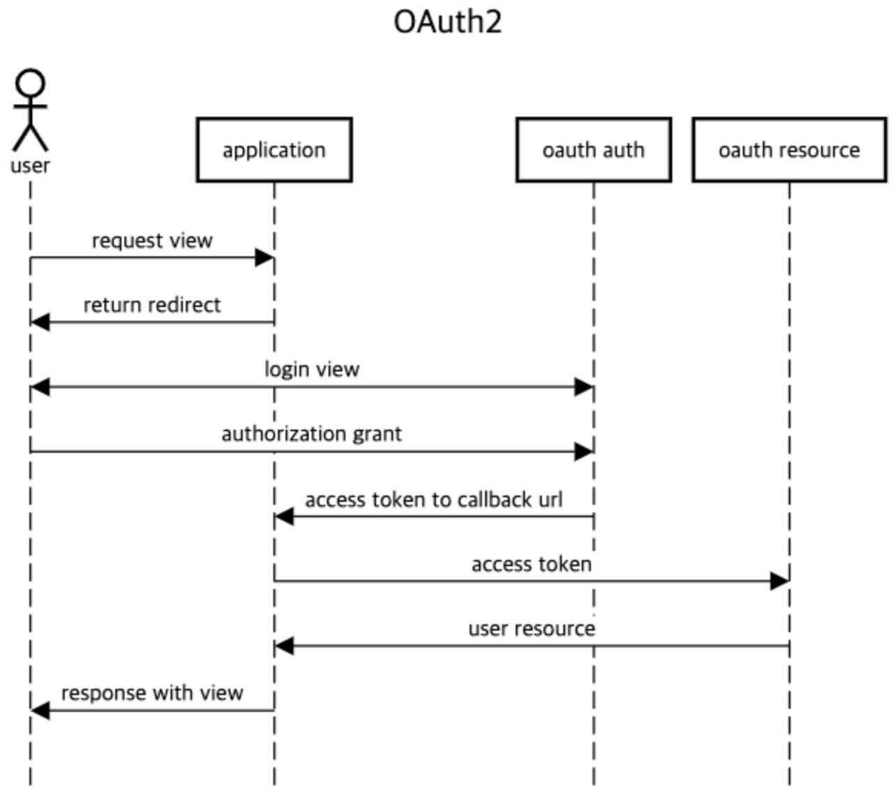

## OAuth2

- 소셜 로그인
  - 서비스의 회원가입과정을 진행할 필요 없이, 제3의 서비스에 등록된 회원 정보를 활용하여 서비스에 로그인하는 기능

- OAuth2
  - Open Authorization의 약자
  - 다른 서비스의 사용자 정보를 안전하게 위임받기 위한 표준
  - 💡 실제로 로그인을 대신해 주는 기술이 아님
  - 사용자가 어떤 서비스에 소셜 로그인을 진행하고 싶을 때 해당 서비스에 직접 인증 정보를 주지 않아도 나의 정보를 조회할 수 있도록 **권한을 위임**하는 기술

- 
1. 사용자가 로그인이 필요한 서비스 요청 (reauest view)
2. 사용자가 소셜 로그인 제공자 선택 (return redirect)
3. 사용자가 선택한 소셜 로그인 화면으로 redirect (login view)
4. 제공자(소셜 로그인) 인증 화면에 사용자가 인증정보 전달 (authorization grant)
5. 정상적인 인증 정보일 경우 **access token**을 발급하여 미리 설정된 URL로 전달 (access token to callback url)
6. access token을 사용하여 제공자의 자원 서버로 전달 (access toekn -> oauth resource)
7. 접속 요청 사용자의 정보 전달 (user resource)
8. 사용자의 정보를 기반으로 서비스 제공 (response with view)

> 💡 OAuth가 사용자의 정보를 제공할 뿐 실제 서비스에 로그인 기능을 만드는 것 x   
> 전달받은 사용자 정보를 바탕으로 사용자 인증 정보를 조절하는 과정이 필요

- OAuth과정은 HTTP통신과 Redirect를 활용
- `3. 사용자가 선택한 소셜 로그인 화면으로 redirect` 과정
  - 인증 성공 -> callback url 제공
  - 서비스 제공자 측에서 로그인을 마치고 나면 해당 url에 사용자 정보를 조회하기 위한 access token을 발급받기 위한 정보를 포함해서 Redirect
  - 개발자는 redirect를 통해 들어온 정보를 이용해 서비스 제공자 서버로 데이터 조회 요청
- Spring Security를 이용해 OAuth구현
  - 1. HTTP통신 부분 직접 작성
  - 2. `spring-boot-starter-oauth2-client` 의존성 활용해 구현
    - `implementation 'org.springframework.boot:spring-boot-starter-oauth2-client'`

---
### [네이버 아이디로 로그인 구현](1.네이버_아이디로_로그인_구성.md)