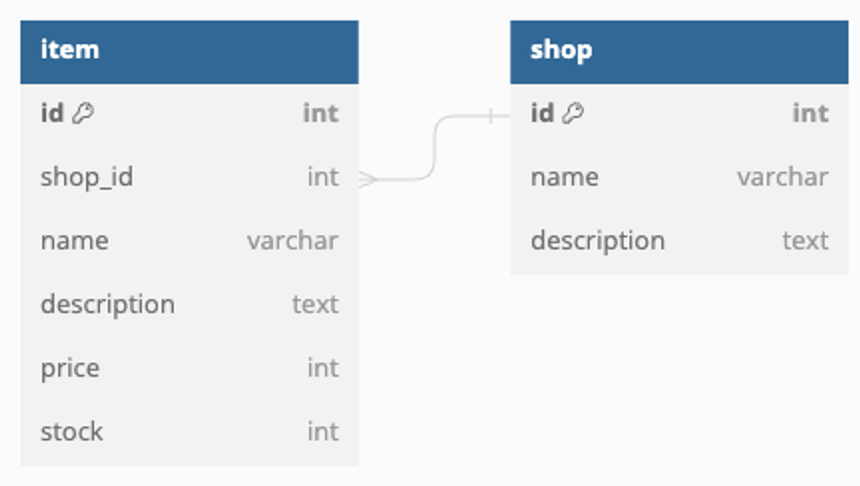
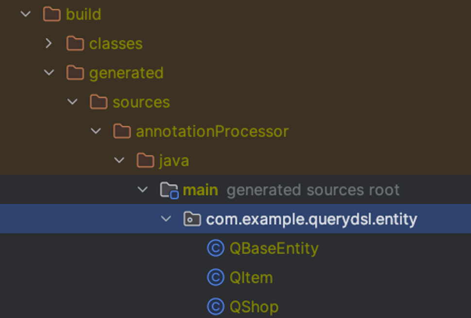

## Querydsl
- 데이터를 조회하는 여러 맥락에 대해 같은 Java코드로 데이터를 조회하는 것을 목표
- JPA, SQL, Lucene(검색 엔진), Mongodb(NoSQL DB) 등 특정 조건을 바탕으로 데이터를 조회할 수 있도록 하는 것이 목표

### JPQL과 비교
JPQL   
- JPQL은 Java 코드로 작성하기 때문에 실행 중(Runtime)에만 오류를 확인 가능
- `EntityManager`를 이용해 단일 Entity를 조회하는 코드를 작성
```java
Item found = entityManager.createQuery("""
        SELECT i FROM Item i WHERE i.nane = :name
        """, Item.class)
        .setParameter("name", "itemA")
        .getSingleResult();
```
- 오타를 발견하기 어렵고, 실행 전까지 실행 성공의 여부를 알 수 없음
- `createQuery`의 인자는 기본적으로 문자열로 취급되는 만큼, 실행하기 전에는 해당 쿼리가 정당한지에 대한 정보를 알 수 없음


Querydsl   
- Querydsl은 오로지 Java 코드 기반으로 동작하기 때문에 JPQL의 가장 큰 단점인 실행 중(Runtime)에만 오류를 확인할 수 있다는 점이 해소
- Querydsl 방식으로 JPQL에서 했던 Entity 조회하는 코드를 작성
```java
JPAQueryFactory queryFactory = new JPAQueryFactory(entityManager);
QItem qItem = new QItem("item");
Item found = queryFactory.selectFrom(qItem)
        .where(qItem.name.eq("itemA"))
        .fetchOne();
```
- 문자열로 개발자가 직접 작성하는 부분이 거의 없음
- 전부 Java 코드 => 컴파일 단계에서 오류를 발견할 수 있음!
- **조회 조건을 따로 추출하는 것이 가능하기 때문에 동적 쿼리를 만들기 유용**

---
### ERD & Entity & `JpaConfig`

```java
@Getter
@MappedSuperclass
public abstract class BaseEntity {
    @Id
    @GeneratedValue(strategy = GenerationType.IDENTITY)
    private Long id;

    @CreatedDate
    private LocalDateTime createdAt;
    @LastModifiedDate
    private LocalDateTime updatedAt;
}
```
```java
@Getter
@Setter
@Builder
@Entity
@NoArgsConstructor
@AllArgsConstructor
public class Item extends BaseEntity {
    private String name;
    private String description;
    private Integer price;
    private Integer stock;

    @ManyToOne
    private Shop shop;
}
```
```java
@Getter
@Setter
@Builder
@Entity
@NoArgsConstructor
@AllArgsConstructor
public class Shop extends BaseEntity{
    private String name;
    private String description;
}
```
```java
@Configuration
@EnableJpaAuditing
@RequiredArgsConstructor
public class JpaConfig {}
```

### Querydsl 설정하기
- 의존성 추가
```groovy
dependencies {
    //querydsl 추가
    implementation 'com.querydsl:querydsl-jpa:5.1.0:jakarta'
    annotationProcessor "com.querydsl:querydsl-apt:${dependencyManagement.importedProperties['querydsl.version']}:jakarta"
    annotationProcessor "jakarta.annotation:jakarta.annotation-api"
    annotationProcessor "jakarta.persistence:jakarta.persistence-api"
}
```
- Querydsl을 JPA와 함께 활용한다면, JPA Entity를 바탕으로 Querydsl에서 사용하는 실제 클래스 정의들을 만들어누어야 함
- Querydsl도 Lombok과 비슷하게 작성된 코드를 바탕으로 새로운 코드를 만들어냄
- 그래서 의존성을 추가하고, 사용하려는 Entity를 만든 다음에 build를 진행해야 정상적으로 활용이 가능
- Gradle을 사용해서 build를 진행하면, `build/generated/sources/annotationProcessor/java/main`에 Querydsl에서 사용하는 클래스 확인 가능
