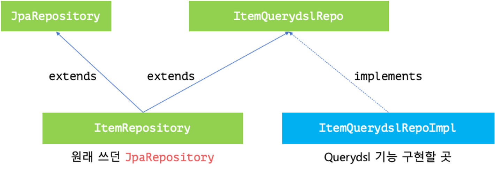

## With Spring Data JPA
- Querydsl은 강력한 도구이지만 설정상의 불편함이 있을 수 있음
- Spring Data JPA는 간단한 요구사항을 쉽게 구현할 수 있게 해주는 여러 기능을 가지고 있음
- => 처음 Querydsl을 시작하면서 만들었던 `QueryDslRepo`를 따로 만들어서 사용 가능
```java
@Slf4j
@Repository
@RequiredArgsConstructor
public class QueryDslRepo {
    private final JPAQueryFactory queryFactory;

    // ... Querydsl 기능
}
```
- 아니면 Spring Data JPA가 제공하는 기능을 이용해서 본래 사용하던 `JpaRepository`의 기능을 확장해서 Querydsl의 기능을 덧붙이기도 가능

### `JpaRepository`와 기능 통합
- Spring Data JPA는 필요에 따라 커스텀 기능을 Repository 인터페이스에 구현하기 위한 방법이 존재
- https://docs.spring.io/spring-data/jpa/reference/repositories/custom-implementations.html   

- 위와 같은 구조로 `interface`와 구현 클래스를 만들어 주면, `ItemRepository`에 직접 만든 기능이 추가되어 사용 가능

### ItemQuerydslRepo
```java
public interface ItemQuerydslRepo {
    List<Item> searchDynamic(ItemSearchParams searchParams);
}
```
- 여기에 실제로 구현할 기능들에 대한 정의가 추가
```java
@Getter
@Setter
@ToString
public class ItemSearchParams {
    private String name;
    private Integer priceFloor;
    private Integer priceCeil;
}
```

### ItemQuerydslRepoImpl
- 이후 이 인터페이스의 실제 구현 클래스를 만듬
- `{interface 이름}Impl`의 형태로 이름을 지어주어야 함
```java
@RequiredArgsConstructor
public class ItemQuerydslRepoImpl implements ItemQuerydslRepo {
    private final JPAQueryFactory queryFactory;

    @Override
    public List<Item> searchDynamic(ItemSearchParams searchParams) {
        return null;
    }
}
```

### extends JpaRepository<T, ID>, ItemQuerydslRepo
- 이후 `ItemQuerydslRepo`를 `ItemRepository`에 상속
- 이중 상속을 받으면 두 interface의 메서드 모두 상속 가능!
```java
public interface ItemRepository 
        extends JpaRepository<Item, Long>, ItemQuerydslRepo {}
```
- 이렇게 제작하면 `ItemRepository`가 의존성으로 주입될 때 만든 `ItemQuerydslRepoImpl`의 기능이 함께 주입되어 `searchDynamic`호출 가능
```java
@Slf4j
@RestController
@RequestMapping("items")
@RequiredArgsConstructor
public class ItemController {
    private final ItemRepository itemRepository;

    @GetMapping("search")
    public List<ItemDto> search(
            ItemSearchParams searchParams
    ) {
        return itemRepository.searchDynamic(searchParams)
                .stream()
                .map(ItemDto::fromEntity)
                .collect(Collectors.toList());
    }
}
```
- ItemDto
```java
@Getter
@Builder
@ToString
@AllArgsConstructor
public class ItemDto {
    private String name;
    private String description;
    private Integer price;
    private Integer stock;

    public static ItemDto fromEntity(Item entity) {
        return ItemDto.builder()
                .name(entity.getName())
                .description(entity.getDescription())
                .price(entity.getPrice())
                .stock(entity.getStock())
                .build();
    }
}
```
> Spring Controller의 [메서드 인자](https://docs.spring.io/spring-framework/reference/web/webmvc/mvc-controller/ann-methods/arguments.html#page-title)에는 다양한 정보가 자동으로 추가되는데, 평범한 클래스가 매개변수로 있을 경우 Query Parameter 중 같은 키를 가진 데이터를 각 속석에 할당


### `Pageable`처리하기
- `JpaRepository`는 `Pageable`을 인자로 전달했는지에 따라 `Page`를 반환하는 `findAll(Pageable pageable)` 메서드가 함게 존재
- `Pageable`을 인자로 받아 페이지 처리 해보자
  - 먼저 `ItemQuerydslRepo`에 메서드 추가   
```java
public interface ItemQuerydslRepo {
    List<Item> searchDynamic(ItemSearchParams searchParams);
    Page<Item> searchDynamic(ItemSearchParams searchParams, Pageable pageable);
}
```
- `ItemQeurydslRepoImpl`에서 메서드를 구현
- `Pageable` 객체에는 몇 페이지인지, `OFFSET`이 얼마인지와 같은 정보가 담겨있음
- 이를 `offset()`과 `limit()`에 전달 가능
```java
@Override
public Page<Item> searchDynamic(ItemSearchParams searchParams, Pageable pageable) {
    List<Item> content = queryFactory
            .selectFrom(item)
            .where(
                    nameEquals(searchParams.getName()),
                    priceBetween(searchParams.getPriceFloor(), searchParams.getPriceCeil())
            )
            .orderBy(item.price.asc())
            .offset(pageable.getOffset())
            .limit(pageable.getPageSize())
            .fetch();

    // ...
}
```
- 반환하려고 하는 `page`는 전체 페이지에 대한 정보를 가지기 위해 총 데이터가 몇개인지 알아야 함
- 이를 위해 `count()`를 사용해서 쿼리를 한번 더 작성해주고, 그 결과를 이용해 `page`의 간단한 구현체인 `PageImpl`을 생성해서 반환하면 기본적인 기능이 만들어짐
```java
@Override
public Page<Item> searchDynamic(ItemSearchParams searchParams, Pageable pageable) {
    List<Item> content = queryFactory
            .selectFrom(item)
            .where(
                    nameEquals(searchParams.getName()),
                    priceBetween(searchParams.getPriceFloor(), searchParams.getPriceCeil())
            )
            .orderBy(item.price.asc())
            .offset(pageable.getOffset())
            .limit(pageable.getPageSize())
            .fetch();

    // 갯수 구하기
    Long count = queryFactory
            .select(item.count())
            .from(item)
            .where(
                    nameEquals(searchParams.getName()),
                    priceBetween(searchParams.getPriceFloor(), searchParams.getPriceCeil())
            )
            .fetchOne();

            // 가장 단순한 Page 구현체
    return new PageImpl<>(content, pageable, count);
}
```
- 또는 `PageableExecutionUtils`를 사용 가능
- 데이터를 바로 조회하지 않고 조회하기 전 단계로 만들어 준 다음 `PageableExecutionUtils.getPage()`의 인자로 메서드 전달
```java
@Override
public Page<Item> searchDynamic(ItemSearchParams searchParams, Pageable pageable) {
    List<Item> content = queryFactory
            .selectFrom(item)
            .where(
                    nameEquals(searchParams.getName()),
                    priceBetween(searchParams.getPriceFloor(), searchParams.getPriceCeil())
            )
            .orderBy(item.price.asc())
            .offset(pageable.getOffset())
            .limit(pageable.getPageSize())
            .fetch();

    JPAQuery<Long> countQuery = queryFactory
            .select(item.count())
            .from(item)
            .where(
                    nameEquals(searchParams.getName()),
                    priceBetween(searchParams.getPriceFloor(), searchParams.getPriceCeil())
            );

                                                             // 데이터의 갯수를 돌려주는 메서드       
    return PageableExecutionUtils.getPage(content, pageable, countQuery::fetchOne);
}
```
- 이렇게 사용할 경우 상황에 따라 갯수 정보가 필요하지 않을 경우 실제로 `countQuery.fetchOne()`을 실행하지 않으므로 조금 더 효율적
- 데이터가 사이즈보다 작은 첫페이지 (첫 페이지의 데이터 갯수가 count)
- 마지막 페이지 일 때 (조회된 데이터 갯수 + Offset이 count)