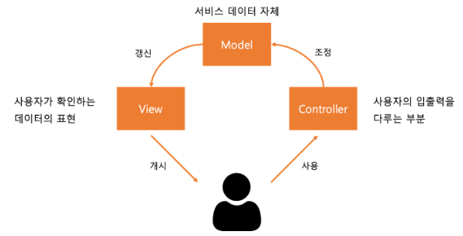
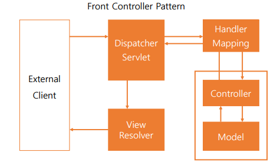

## Spring MVC
### MVC 패턴
디자인 패턴 : 완성된 코드가 아닌 문제를 해결할 때 자주 사용되던 코드의 구조 

MVC 디자인 패턴 : 사용자 인터페이스를 비즈니스 로직으로부터 분리하는 것을 목표로 만들어진 디자인 패턴   
디자인 패턴
- Model : 어플리케이션을 표현하기 위한 데이터를 관리(비즈니스 로직)하는 부분, 데이터의 변화를 View에게 통보
- View : 사용자에게 정보가 표현되는 방식을 관리하는 부분, View의 표현은 Model의 (데이터)상태에 따라 변화 
- Controller : 사용자의 입력을 받아, Model이 이해할 수 있는 형태로 변환하여 전달

- ***관심사 분리*** : 각자가 담당하는 역할을 나누는 것
----
### Spring MVC

1. 외부의 클라이언트(External Client)가 요청을 보냄 -> Spring MVC의 Dispatcher Servlet으로 전달

2. Dispatcher Servlet은 적당한 Controller의 RequestMapping으로 위임

3. Controller는 요청을 Model에 전달, Model은 명령을 처리하여 갱신된 데이터를 전달하거나, 명령 처리의 상태에 대해 알림

4. Controller는 Model에게 받은 데이터를 표현할 View를 선정해 DispatcherServlet에 전달

5. DispatcherServlet은 다시 요청을 보낸 클라이언트로 응답을 번역해 전송

- 여기서 Spring Boot를 이용한 웹 개발을 진행하는 경우, `@Controller` 어노테이션으로 지정한 클래스를 MVC 패턴의 Controller로 활용
