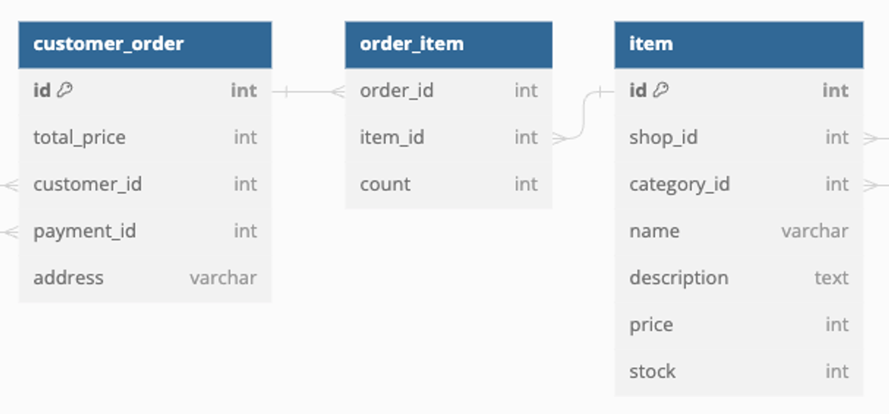
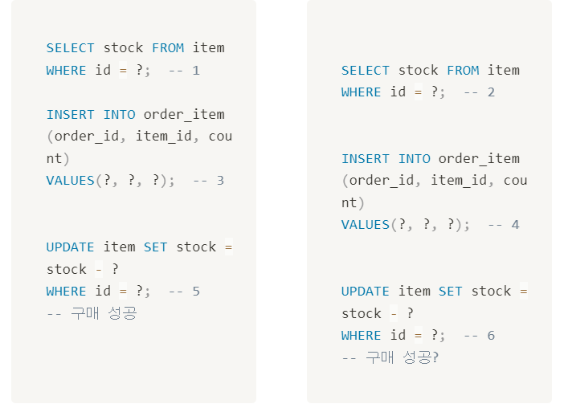

## Transaction

- Q. 사용자가 물건을 구매하고자 한다면 
1. 데이터베이스에서 해당 물건의 재고 확인
2. 수량이 충분할 경우 주문정보 생성
3. 주문 정보에 포함된 만큼 `stock` 컬럼의 데이터 감소
```SQL
-- 해당 물건의 재고 확인
SELECT stock FROM item WHERE id = ?;

-- 재고가 구매하려는 수량보다 많음을 확인 후 주문정보 생성
INSERT INTO order_item(order_id, item_id, count)
VALUES(?, ?, ?);

-- 주문 정보에 포함된 만큼 stock 컬럼의 데이터 감소
UPDATE item SET stock = stock - ?
WHERE id = ?;
```

- Q. 만약 두 사용자가 재고가 3개 남은 물품을 거의 동시에 2개씩 구매하려는 경우

- 두번쨰로 처리되는 사용자는 실제로 존재하지 않는 물품을 구매하게 됨
- 이런 상황에 대처하기 위해 등장하는 개념이 **Transaction**

### Transaction
- 어떤 작업을 하기 위한 일련의 SQL 문의 모음을 지칭하는 개념
- 트랜잭션 실행 중 특정 단계에 문제가 생겨 정상적으로 수행이 불가능할 경우, 데이터베이스의 상태를 트랜잭션이 시작 되기 이전으로 되돌림
```sql
START TRANSACTION;

SELECT stock FROM item WHERE id = ?;

INSERT INTO order_item(order_id, item_id, count)
VALUES(?, ?, ?);

UPDATE item SET stock = stock - ?
WHERE id = ?;

-- 여태까지 작업을 되돌린다.
ROLLBACK;
-- 여태까지 작업을 실제로 데이터베이스에 반영한다.
COMMIT;
```
- `START TRANSACTION(BEGIN TRANSACTION)` : 이 이후 실행되는 SQL 문들을 트랜잭션으로 취급
- `ROLLBACK` : 이 구문이 실행되면 트랜잭션으로 실행되었던 `INSERT`나 `UPDATE`가 취소되며, 트랜잭션 실행 이전의 상태로 돌아감
- `COMMIT` : 이 구문이 실행되면 트랜잭션에 있었던 일이 전부 데이터베이스에 정상적으로 반영, 트랜잭션의 성공적 수행


### ACID
데이터 무결성과 오류 상황 대처에 대한 안정성을 제공하기 위해 트랜잭션이 가져야 하는 특징
- Atomicity(원자성) 
  - 트랜잭션이 하나의 작업 단위로 취급
  - 나누어 실행할 수 없음
  - 일부가 실패하면 전체가 실패
- Consistency(일관성) 
  - 트랜잭션 실행 전후로 데이터베이스의 상태가 일관성(제약사항)을 유지
- Isolation(격리성) 
  - 트랜잭션 각각이 다른 트랜잭션과 독립적
  - 하나의 트랜잭션은 다른 트랜잭션의 연산을 참조 불가능 ( 격리 수준에 따라 조정 가능 )
- Durability(지속성) 
  - 트랜잭션이 마무리되면 결과가 영속성을 가져야 함
  - 이후 작업들의 실패나 시스템 오류로부터 데이터가 안전하게 지켜져야 함

    

### `@Transactional`
- 특정 클래스나 메서드에 붙여서 해당 메서드에서 하는 데이터베이스 작업을 트랜잭션으로 만들어주는 어노테이션
```java
public void createOrder() {
    Customer customer = customerRepository
            .findById(1L).orElseThrow();
    Order newOrder = orderRepository.save(Order.builder()
            .customer(customer)
            .build());
    Item item = itemRepository.findById(2L).orElseThrow();
    orderItemRepository.save(OrderItem.builder()
            .order(newOrder)
            .item(item)
            .count(10)
            .build());
    if (!(item.getStock() < 10)) {
        item.setStock(item.getStock() - 10);
        itemRepository.save(item);
    }
    else throw new IllegalStateException();
}
```
- 테스트 데이터와 함께 이 메서드를 연속적으로 호출하면 어느 시점에서 `item.stock`의 갯수가 10개 미만이 되어 `IllegalStateException`이 발생
- `Order`가 나타내는 새로운 주문 정보와 해당 주문이 포함되는 아이템을 나타내는 `OrderItem`에 해당하는 줄은 계속해서 생성이 됨
- `@Transactional` 어노테이션  추가
```java
@Transactional
public void createOrder() {
    Customer customer = customerRepository
            .findById(1L).orElseThrow();
    Order newOrder = orderRepository.save(Order.builder()
            .customer(customer)
            .build());
    Item item = itemRepository.findById(2L).orElseThrow();
    orderItemRepository.save(OrderItem.builder()
            .order(newOrder)
            .item(item)
            .count(10)
            .build());
    if (!(item.getStock() < 10)) {
        item.setStock(item.getStock() - 10);
        itemRepository.save(item);
    }
    else throw new IllegalStateException();
}
```
- 어노테이션이 붙으면 `IllegalStateException` 예외가 발생하면서 본래 만들었던 `Item`이나 `NewOrder`등의 데이터가 데이터베이스에 남지 않음   
=> **`RollBack`**

### 트랜잭션 전파(Transaction Propagation)
- `@Transactional` 메서드에서 `@Transactional` 메서드를 호출할 경우
- 호출한 메서드를 현재 트랜잭션의 일부로 취급할 것인지, 아니면 새로운 트랜잭션으로 취급할 것인지 결정하는 것 => **트랜잭션 전파**
- `@Transational`의 `propagation`을 정의하여 결정 가능
  - `REQUIRED` (기본값) : 현재 트랜잭션이 실행된 상태라면, 해당 트랜잭션의 일부로 실행 / 아니라면 새로운 트랜잭션 생성
  - `SUPPORTS` : 트랜잭션이 실행되었다면 그 일부로 실행 / 아니라면 트랜잭션 없이 실행
  - `MANDATORY` : 트랜잭션이 실행되었다면 그 일부로 실행 / 트랜잭션이 없을 경우 예외 발생
  - `NEVER` : 트랜잭션이 실행되었다면 예외 발생 / 없을 경우 트랜잭션 없이 실행
  - `NOT_SUPPORTED` : 트랜잭션이 실행된 상태라면, 해당 트랜잭션을 대기시킨 뒤 트랜잭션 없이 실행
  - `REQUIRES_NEW` : 트랜잭션이 실행된 상태라면, 해당 트랜잭션을 대기시킨 뒤 트랜잭션을 새로 실행
  


### 격리 수준
- ACID의 특징 중 Isolation은 서로 다른 트랜잭션이 서로의 상태를 확인할 수 없게 격리되어, 
- 트랜잭션이 완료되어야 커밋된 내역을 확인할 수 있다는 특징
- 격리 수준을 조절하여 다른 트랜잭션에서 있었던 일을 어느 정도까지 확인할 수 있는지 조절 가능
- 격리성의 정도에 따라 발생할 수 있는 문제가 달라지며 Dirty Read, Non-Repeatable Read, Phantom Read 문제 발생
---
- Dirty Read : 수정되었지만 커밋되지 않은 변경사항을 읽어들이는 문제
  - 한쪽 트랜잭션에서 일어났던 일이 커밋 이전에 읽어진 다음, 롤백이 일어나게 되면 다른 트랜잭션에서는 잘못딘 정보를 바탕으로 작업이 수행될 수 있음


- Non-Repeatable Read : 한번 읽어 들였던 데이터 뎔의 내용이, 다른 트랜잭션의 커밋으로 인해 변경되는 문제


- Phantom Read : 한번의 트랜잭션에서 두번의 같은 조회를 하였는데, 다른 트랜잭션의 커밋으로 인해 다른 데이터를 반환받게 되는 문제
---
- 격리 수준을 조절함으로 이런 문제들은 방지가 가능하지만, 격리 수준이 높아질수록 성능이 떨어짐
- DBMS에 따라 지원하거나 지원하지 않는 경우도 있음
- `@Transactional`의 `isolation`으로 설정
- `DEFAULT` (기본값) : 사용하는 DBMS의 설정을 사용하는 격리 수준


- `READ_UNCOMMITTED` : 서로 다른 트랜잭션에서 커밋되지 않은 데이터를 읽을 수 있음
  - Dirty Read, Non-Repeatable Read, Phantom Read 현상이 전부 발생


- `READ_COMMITTED`: 커밋된 데이터를 읽을 수 있음
  - Dirty Read가 방지되지만 / Non-Repeatable Read, Phantom Read 현상이 발생


- `REPEATABLE_READ` : 아직 커밋되지 않은 정보를 가진 열의 읽기를 방지
  - Dirty Read와 Non-Repeatable Read가 방지되지만 / Phantom Read 현상이 발생


- `SERIALIZABLE` : 동시에 실행되는 트랜잭션을 연쇄적(Serial)으로 실행
  - 모든 문제 방지, 트랜잭션이 동시에 실행되지 않음(순차적으로 실행)