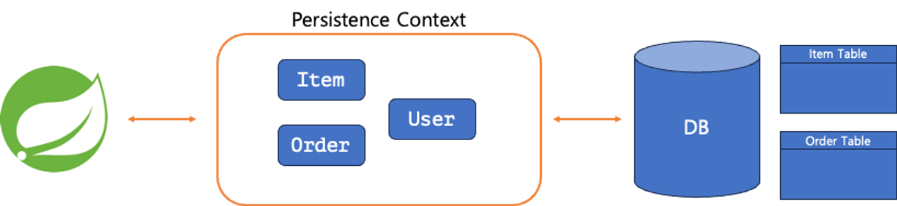

## Transaction
### Persistence Context(영속성 컨텍스트)
- 메서드는 Call Stack에서, 객체는 Heap에서 데이터 관리
- 영속성(Persistence) : 데이터가 프로그램이 종료되고 난 뒤에도 남아있는 특성
  - Java 에서 만드는 변수와 객체는 전부 휘발성 => 영속성 없음
  - 파일(DB)의 형태로 저장 => 프로그램이 종료되도 남아있음 => 영속성 있음!


- JPA를 사용하면 데이터베이스와 JPA 사이에 영속성 컨텍스트를 생성
  - 간단하게 Spring Boot와 데이터베이스 사이의 Entity용 가상 데이터베이스
  - Entity 객체를 매번 데이터베이스와 주고받지 않고 어플리케이션 내부에서 관리 (중간 관리자 역할)
  - 데이터베이스에서 조회한 데이터는 영속성 컨텍스트에서 관리, 상황에 따라 데이터베이스와 직접소통하는 대신 관리하고 있는 Entity객체 활용
---

### 1차 캐시 - First Level Cache
- 어떤 Entity가 작성 또는 조회가 될 때 영속성 컨텍스트에서 우선적으로 관리
- 데이터베이스에 실제 접근 횟수를 줄여 성능상의 이점
- 한번의 트랜잭션에서 조회된적 있는 데이터는 컨텍스트에서 관리
- 같은 데이터를 여러번 조회하거나 방금 생성한 데이터의 내용을 조회하는 등의 작업이 필요할 때 성능 향상
- 영속성 컨텍스트가 Entity 객체를 직접 들고 있기 떄문에, 특정 조건을 통해 조회한 두개의 Entity 객체는 동일한 참조(Heap 상의 위치), 동일한 인스턴스를 가르킴
- 조회한 Entity의 동일성이 보장
```java
@Test
@DisplayName("동일성 보장")
public void testIdentity() {
    // given
    Instructor instructor = Instructor.builder()
            .name("asdf")
            .build();
    Long id = instructorRepository.save(instructor).getId();

    // when
    Instructor a = instructorRepository.findById(id).get();
    Instructor b = instructorRepository.findById(id).get();

    // then
    assertSame(a, b);
}
```

### 쓰기 지연 (Transactional Write-Behind)
- 데이터베이스에 데이터를 저장하는 작업은 입출력 작업의 일종
- 영속성 컨텍스트는 어떤 순서대로 `INSERT`가 있었는지 기억했다가 트랜잭션이 마무리 되었을 떄 한번에 반영
- 입출력 작업의 횟수를 줄이고 성능 향상


### 변경 감지 (Automatic Dirty Checking)
- 트랜잭션 내부에서 Entity가 수정되면 트랜잭션이 마무리 되는 시점에 자동으로 차이점을 확인해 반영 (`UPDATE`)
- 특정 Entity를 수정하는 과정에서 데이터베이스에서 데이터를 조회하면 해당 Entity가 영속성 컨텍스트에 1차 캐시로 저장
- 메서드에서 Entity를 수정하면 트랜잭션이 마무리 될 때 처음 조회했던 상태와 비교
- 변경된 내용이 있따면 해당 내용을 반영할 수 있도록 `UPDATE` SQL 문이 자동으로 생성

---
- JPA를 사용하면 실제 영속성 컨텍스트와 소통하는 객체는 `EntityManager`
- Spring Data JPA를 사용할 때 활용 가능한 `JpaRepository`는 해당 `EntityManager`를 한단계 더 추상화하여 편의성 좋게 사용할 수 있게 만든 인터페이스
- 결국 Spring Data JPA도 영속성 컨텍스트를 이용하는 것
- `@Transactional` 어노테이션을 이용해 트랜잭션을 시작, 영속성 컨텍스트의 특징을 전부 활용 가능