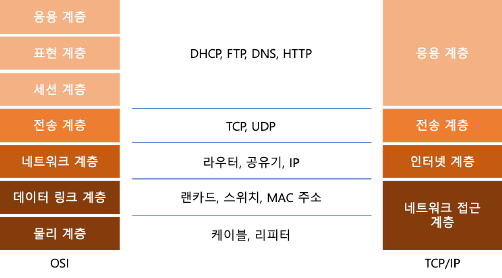

## Web
### OSI 와 TCP/IP

- OSI 7계층 : 네트워크에서 통신이 일어나는 과정을 7단계로 나눠 설명한 모델
- TCP/IP 모델 : Internet Protocol Suite의 다른 말, 인터넷이 어떻게 동작하는지를 실무적인 관점에서 설명한 모델

---
**물리 계층**    

전기적, 기계적 특성을 이용해 순수한 데이터를 비트(0과 1)로 표현해 전달하는 역할(케이블, 리피터, 허브 등)
- 케이블은 전기를 보내 전압차로 0과 1을 전달
- 리피터는 신호의 조작 없이 더 먼곳에 신호 전달
- 허브는 똑같은 신호를 다른 케이블로 전달

---
**데이터 링크 계층**   

데이터를 전송받을 수 있는 두 기계(Node) 사이의 연결 계층 (랜카드, 네트워크 스위치 등)
- 각 기계 사이의 데이터를 안전하게 전달하는 역할
- 물리 계층의 오류를 감지, 데이터 재전송하는 역할
- 데이터 전달을 위해 MAC 주소를 사용

---
**네트워크 계층**   

데이터 링크 계층은 데이터를 받을 수 있는 Node와 Node를 연결하면 네트워크를 이룸(공유기, 라우터 등)
- 네트워크 계층은 이런 Node의 네트워크 내부의 데이터 전송
- 네트워크와 네트워크 사이에서 데이터를 어떻게 전송할지를 결정
- 데이터가 너무 크다면 데이터의 크기를 조정하는 역할

IP - Internet Protocol : 두 컴퓨터 사이에 연결된 노드들을 통해 데이터를 전달하는 방법을 정의하는 규약
- Ip 주소를 통해 네트워크의 컴퓨터를 구분
- 데이터가 온전히 전달되는지를 보장하지는 않음

---
**전송 계층**   

실제로 데이터가 사용자(클라이언트 - 서버)가 의도한 대로 전송되도록 해주는 계층
- 데이터가 손실이 있었는지 판단
- 손실이 발생하면 재전송을 요청하는 등
- 어느정도 데이터가 한번에 보내져야 할지 등의 규약이 정의되는 계층
- IP 주소를 통해 컴퓨터를 결정하면 Port 번호를 통해 특정 프로세스를 결정

TCP (Transmission Control Protocol)
- 실제로 전달할 데이터를 작은 단위로 나누어져
- 해당 데이터가 정상적인지를 판단하기 위한 정보와 함께 패킷 단위로 전송
- TCP Header : 정상적으로 전송되었는지, 몇번째 데이터인지에 대한 정보가 담김
---
**세션 계층 & 표현 계층**   

세션 계층 - TCP를 비롯한 전송 계층 통신의 세션을 관리하는 계층
- 세션 : 컴퓨터들이 연결된 상태
- 두 컴퓨터를 연결하고
- 연결을 제어하고
- 연결을 중단하는 역할

표현 계층 - 전달된 데이터를 사용하는 시스템의 형식에 맞게 변환하는 계층
- 하위 계층에서 데이터를 정상적으로 전송할 수 있도록 변환
- 전송받은 데이터를 정상적으로 해석할 수 있도록 변환
- 전달된 데이터를 시스템에서 사용할 수 있는 형태로 변환

---
**응용 계층**   

하위 계층을 통해서 전달된 데이터는 컴퓨터(프로세스)가 해석할 수 있는 형태로, 온전히 전달되었을 것을 기대
- 그 전달된 데이터가 어떤 형태여야 하는지를 정의하는 계층
- ex) HTTP, SMTP, FTP...